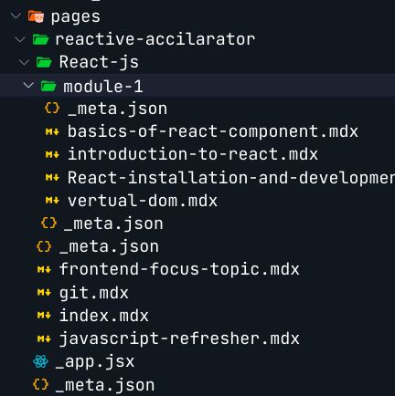
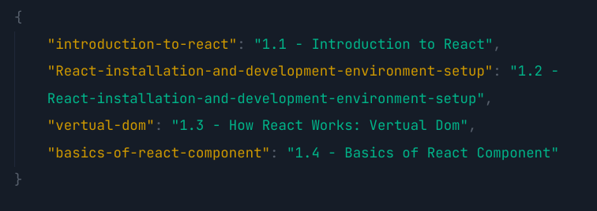

# Reactive Accilarator

**This is documantation project to make document my learing from Reactive Accilarator Course from [LWS-Learn With Sumt](https://learnwithsumt.com) Created with [NextJS](http://nextjs.org)**

## Getting Started

To run this project to you local development mode, First -> run the development server:

```bash
npm run dev
# or
yarn dev
# or
pnpm dev
# or
bun dev
```

Open [http://localhost:3000](http://localhost:3000) with your browser to see the result.

## Contribution Guidelines

When contributing to this repository, please first discuss the change you wish to make via [issue](https://github.com/Deveripon/reactive-accelarator/issues), [email](mailto:devripon.io@gmail.com), or any other method with the owners of this repository before making a change.

## How to work on docs

Current Files and Folder Structure is



-   **In this tree we are working on, you can create a file with the of the lesson you want to add documentation with .mdx extension.**
-   In co-located `_meta.json` file you can define the lesson name as object which will be show in UI.

Example:



## Commiting

Try to use conversational Commit when you commiting. like, `Doc Update : I am updated the Lesson XX documentation Commiting `

