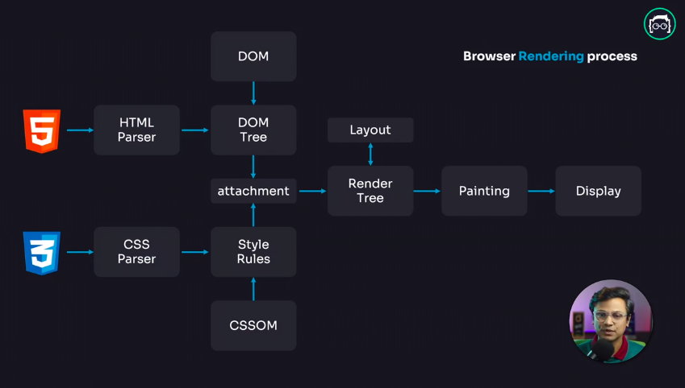
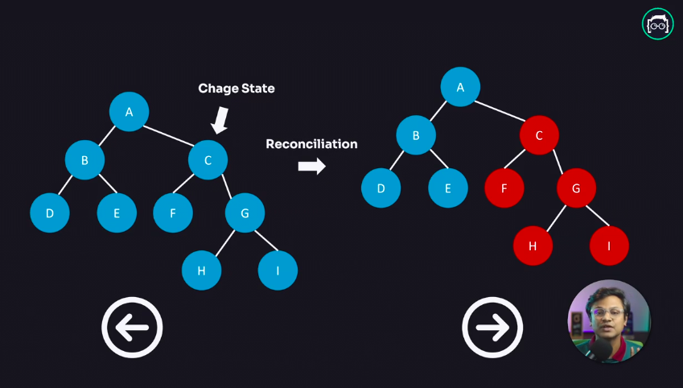

## DOM কি আসলেই স্লো?

নাহ, ডম কখনোই স্লো না । আসলে যদি ভালোভাবে কোড করা হয় তাহলে ডম যেকোন কিছুর থেকে ফাস্ট। কিন্তু বর্তমান বিশ্বে ওয়েব অ্যাপ্লিকেশনগুলো অনেক বেশি ইন্টারেক্টিভ,তাই যখনই ইউজার কোন ইন্টারেকশন করে তখন ব্রাউজারকে আবার তা নতুন করে পুরো ওয়েবসাইটটা রি-পেইন্ট করতে হয়। এইরকম যখন অনেকগুলো রিয়াকশনের কারনে ব্রাউজারকে বার বার রি পেইন্ট করতে হয় তখন সেই রি-পেইন্টিং প্রসেসটা স্লো হয়ে যায়,মুলত ডম কিন্তু স্লো নয় ।

## ব্রাউজার কিভাবে DOM রেন্ডার করে ?

আমরা দেখতে পাচ্ছি যে উপরে একটা গ্রাফ এর মাদ্ধমে ব্রাউজার এর রেন্ডারিং প্রসেস দেখানো হয়েছে । এখানে আমরা কি দেখতে পাচ্ছি ? আমরা দেখতে পাচ্ছি যে, যখন ব্রাউজার কোন `HTML` `CSS` ফাইল পায়,তখন সেই ফাইলটা একটা পারসিং এর মদ্ধে দিয়ে নিয়ে যায়, এক্ষেত্রে `HTML` এর জন্য `HTML PARSER` ও `CSS` এর জন্য `CSS PERSER` ব্যাবহার হয়। এসব পারসার দিয়ে পারসিং এর পর ব্রাউসার `HTML` দিয়ে একটা `DOM TREE` বানায় এর `CSS` দিয়ে `CSSOM` নামে একটা `STYLE RULES` বানায় , এবং `DOM TREE` ও `STYLE RULES` একসাথে ATTACH হয়ে একটা `RENDER TREE` বানায়। এই `RENDER TREE` ব্রাউসারে একটা `LAYOUT` ফেস এর মদ্ধে দিয়ে যায়। এই `LAYOUT` ফেস এ `DOM TREE` টা ব্রাউসার এর কোথায় রেন্ডার হবে তার একটা CORDINATE রেডি হয়ে যায় । এবং ফাইনালি ব্রাউজার তার PAINTING মেকানিজম এর মাদ্ধমে তা ব্রাউসারে পেইন্ট করে দেয় এবং আমরা ফাইনাল আউটপুট দেখতে পাই।

## ভার্চুয়াল ডম কি ? কিভাবে ভার্চুয়াল ডম কাজ করে?

ভার্চুয়াল ডম রিয়াক্ট এর একটা ফান্ডামেন্টাল বিষয় । রিয়াক্ট এর ভিত্তিটাই মূলত এই ভার্চুয়াল ডম ।

ব্রাউজারের রি-পেন্টিং প্রসেসটা এপ্লিকেশনকে স্লো ডাউন করে দেয়, এই সমস্যা এড়ানোর জন্য আমরা কি করতে পারি ভাবুনতো। আমরা মূলত দুইটা ভাবে এটার সমাধান করতে পারি :

-   আমরা ব্যাচ আপডেট করতে পারি,
-   আমরা ডম ম্যানুপুলেশন কম করতে পারি।

রিয়াক্ট তার ভার্চুয়াল ডমের মাদ্ধমে সেই কাজটাই করে । রিয়াক্ট একেবারে মিনিমাম ডম ম্যানুপুলেশন করে ।

যখন এপ্লিকেশনে কোন ইউজার কোন ইন্টারেকশন করে তখন যদি `UI` তে কোন চেঞ্জ করতে হয় তখন রিয়াক্ট সরাসরি `HTML` এর `DOM TREE` টাকে চেঞ্জ করে দেয়না। যখনি `UI` তে কোন চেঞ্জ আসে,রিয়াক্ট তার ভার্চুয়াল `DOM` এর সাহায্যে `UI` এর একটা রেপ্লিকা বা কপি বানিয়ে নেয় । তারপর রিয়াক্ট তার একটা নিজস্ব বানানো এলগরিদম `Diffng` বা `Reconciliation` এলগরিদম এর মাদ্ধমে চেক করে যে `UI` এর ঠিক কোন জায়গায় চেঞ্জ হয়েছে । এতে করে পুরো ওয়েবসাইটটা রি-রেন্ডার না করে শুধুমাত্র যেই অংশে পরিবর্তন হয়েছে,সেই অংশটুকু `DOM` এ আপডেট করে দেয়। এতে করে রিয়াক্ট মিনিমাম ডম অপারেশনের মাদ্ধমে এপ্লিকেশনএর পার্ফমেন্স ইম্প্রুভ করে ।

