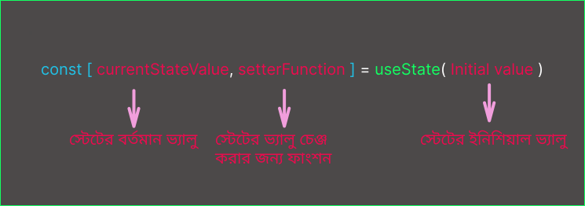

import { Callout, Steps } from "nextra/components";

রিয়াক্ট এপ্লিকেশনে যখনি কোন এন্টারেকশনে কোনকিছু চেঞ্জ করা প্রয়োজন হয় তখনি স্টেট এর প্রয়োজন হয়।

### স্টেট (State) কি ?

`State` এর বাংলা মানে হলো অবস্তা । ভিন্ন ভিন্ন অবস্থার স্টেট হয় ভিন্ন ভিন্ন।

ধরুন একটা `Button` এ ক্লিক করলে একটা `Modal` ওপেন হবে । এইযে `Modal` একবার ওপেন হবে এটা একটা অবস্থা, আবার যখন `Modal` ক্লোজ থাকবে সেটা আবার আরেক অবস্থা। এটাকেই বলা হয় `State`।

রিয়াক্ট যেহেতু একটা রিয়াক্টিভ এপ্লিকেশনে সাহায্য করে তাই রিয়াক্ট যাতে বুঝতে পারে যে এপ্লিকেশনে কিছু চেঞ্জ হয়েছে,তাকে রি-রেন্ডার করতে হবে, এবং কোন অবস্থায় কি ছিল, সেটা তাকে মনে রাখতে হবে তাই তাকে এপ্লিকেশনের বিভিন্ন স্টেট ম্যানেজ করা লাগে। আর এই কাজটা রিয়াক্ট করে তার বিল্ট ইন `hook` `useState` এর মাধ্যমে।

### এই কাজগুলো কি আমরা রেগুলার ভেরিয়েবল নিয়ে কন্ডীশনালি করতে পারিনা ?

নাহ, রিয়াক্ট এপ্লিকেশনে আমরা সেটা পারিনা,কেননা রিয়াক্ট এপ্লিকেশনে কোনকিছু চেঞ্জ হলেই তার কম্পোনেন্টকে রি-রেন্ডার করতে হয় এবং `UI` আপডেট করতে হয়। কিন্তু আমরা যদি লোকাল ভ্যারিয়েবল নিয়ে তার মদ্ধে ভ্যালু চেঞ্জ করে দেই,তাহলে রিয়ায়ক্ট সেটাকে মনে রাখতে পারেনা এবং তাতে সে রি-রেন্ডার ও ট্রিগার করেনা। তাহলে হয়তো ভাবতে পারেন যে ,আমরা ম্যনুয়ালি `UI` আপডেট করে দিলেইতো হয়ে গেল, হ্যাঁ - কিন্তু তাহলে আমরা রিয়াক্টে কেন এসেছি ? রিয়াক্টে এসেছি কারণ যাতে আমাদের কোন কিছু চেঞ্জ হলেই যাতে `UI`অটোমেটিক আপডেট হয়।

### লোকাল ভেরিয়েবল এর ক্ষেত্রে যেসব বিষয় হয়নাঃ

1. **Local variables don't persist between renders:** মানে হলো যখন কম্পোনেন্ট রি-রেন্ডার হয়, তখন পুরো কম্পোনেন্টটা আবার নতুন করে রেন্ডার হয়। তখন সে তার লোকাল ভেরিয়েবল এ আগের রেন্ডারে কি চেঞ্জ হয়েছিল তা সে মনে রাখেনা ।

2. **Changes to local variables won't trigger renders:** মানে হলো লোকাল ভেরিয়েবল চেঞ্জ হলে রিয়েক্ট বুঝতেই পারেনা যে, তাকে কম্পোনেন্ট রি-রেন্ডার করতে হবে।

---

**কম্পোনেন্টকে নতুন ডাটা দিয়ে আপডেট হতে হলে দুইটা জিনিস লাগেঃ**

1. **Retain the data between renders:** এর মানে হলো রি-রেন্ডারের পর কম্পোনেন্টকে জানতে হয় যে তার আগের রেন্ডারে কি চেঞ্জ হয়েছিল,যেটা সে `UI` তে আপডেট করবে।

2. **Trigger a Re-render:** মানে হলো কোন স্টেট চেঞ্জ হলেই রিয়াক্টকে তার রি-রেন্ডার ট্রিগার করতে হয় ।

---

**`useState` হুক এই দুটি জিনিস দিয়ে থাকেঃ**

1. **A State Variable:** `useState` হুক একটি স্টেট ভেরিয়েবল দেয় যা সে প্রতিটা রি-রেন্ডারে মনে রাখতে পারে ।

2. **A Setter Function:**`useState` হুক একটি `setter function` দেয় যা দিয়ে সে স্টেট ভেরিয়েবলকে চেঞ্জ করতে পারে ।

### `useState` হুক - কিভাবে লিখতে হয় এবং কিভাবে ব্যাবহার করতে হয় ?

**সিনট্যাক্সঃ**

```jsx
const [currentValue, setterFunction] = useState(initialValue);
```



<Steps>

### রিয়াক্ট থেকে `useState` হুক ইম্পোর্ট করতে হবেঃ

```jsx filename="App.jsx" showLineNumbers {1}
import { useState } from "react";

export default function App() {
    return (
    <>
        <h1>Count:  </h1>
        <button>Click to Incriment Count</<button>
    </>
    );
}
```

### `useState` হুক ডিক্লেয়ার করা ।

```jsx filename="App.jsx" showLineNumbers {4}
import { useState } from "react";

export default function App() {
const [count, setCount] = useState(0);

    return (
    <>
         <h1>Count:  </h1>
        <button>Click to Incriment Count</<button>
    </>
    );
}
```

### `setter function` এর মাধ্যমে `State variable` এর ভ্যালু চেঞ্জ করা এবং ভ্যালু ব্যাবহার করা ।

```jsx filename="App.jsx" showLineNumbers {7,11-12}
import { useState } from "react";

export default function App() {
const [count, setCount] = useState(0);

    function handleCountIncriment() {
        setCount(count + 1);
    }
    return (
    <>
         <h1>Count: {count}  </h1>
        <button onClick={handleCountIncriment}>Click to Incriment Count</<button>
    </>
    );
}
```

</Steps>

**রিয়াক্টে সকল ফাংশন যেগুলা শুরুতে `use` দিয়ে নামকরন করা হয়েছে সেগুলা প্রতিটাই হলো হুক। শুধু `useState` ই নয়,রিয়েক্টের এমন বিল্ট ইন আরও অনেক হুক রয়েছে যেগুলো আমরা পরে যানতে পারবো । এসব প্রতিটা হুক রিয়াক্টে আলাদা আলাদা ফিচার যুক্ত করেছে। তাই রিয়াক্টের হুকগুলো হলো একেকটা স্পেশাল ফাংশন । তাই এগুলোকে নরমাল ফাংশনের মতো চিনটা করলে হবেনা। আর রিয়াক্টের হুকগুলোকে সবসময় কম্পোনেন্টের টপ লেভেলে ব্যাবহার করতে হয় । এগুলোকে কখনওই কোন কন্দীশন,লুপ বা অন্যান্য ফাংশনের ভিতরে ব্যাবহার করা যাবেনা । **

### রিয়াক্টের `useState` হুক কিভাবে কাজ করে ?

যখনি আমরা কোন কম্পোনেন্টের ভিতরে `useState` লিখি,তার মনে হলো রিয়াক্টকে বলা যে, আমার এই কম্পোনেন্টে কিছু স্টেট আছে সেগুলো তোমাকে মনে রাখতে হবে ।

```jsx
const [index, setIndex] = useState(0);
```

এক্ষেত্রে আমরা স্টেট ভেরিয়েবল নিয়েছি `index` । তাহলে রিয়াক্ট প্রতিটা রেন্ডারে `index` এর ভ্যালুটাকে তার মেমরিতে মনে রাখবে।

<Callout
    type='info'
    emoji='📔'>
    `State`এর নেমিং কনভেনশন হলো - যেই নামে স্টেট ভেরিয়েবল নেয়া হয়েছে,
    `setterFunction` এর নামটাও সেই নামটাকে ফলো করেই দেয়া উচিত । যেমন: `const
    [index, setIndex] = useState(0);`
</Callout>

#### রেন্ডার এবং রি-রেন্ডারিং প্রসেসঃ

```jsx
const [index, setIndex] = useState(0);
```


1. **প্রথমবার যখন কম্পোনেন্ট রেন্ডার হয়ঃ** আমারা স্টেট ভেরিয়েবলের ইনিশিয়াল যে ভ্যালু দিয়েছিলাম সেটাই রিটার্ন করে। এক্ষেত্রে `initial value = 0` তাই স্টেট `0` রিটার্ন করবে ।

2. **যখন স্টেট ভেরিয়েবল এর ভ্যালু আপডেট করা হয়ঃ** যখন ইউজারের ক্লিক বা কোন ইন্টারেকশনে `setter function` দিয়ে ভ্যালু আপডেট করা হয় `setIndex( index + 1 )` তখন স্টেটের ভ্যালু চেঞ্জ হয়ে হয় `1` এবং রিয়েক্টকে তা মনে রাখতে বলে এবং তারপর `setter function` রিয়াক্টের `Render()` মেথড কল করে দিয়ে আরেকটা রেন্ডার ট্রিগার করে দেয় ।

3. **দ্বিতীয়বার যখন রেন্ডার হয়ঃ** তখন কম্পোনেন্ট আবার নতুন করে রেন্ডার হয় এবং রিয়াক্ট দেখে যে `useState(0)` এর `initial value 0 ` কিন্তু আগের রেন্ডারে যখন `state value` চেঞ্জ হয়েছে তখন রিয়াক্ট সেটাকে মনে রেখেছে, আর তাই সে তখন `index` এর ভ্যালু `1` রিটার্ন করবে ।

আর এভাবেই প্রতিটা রেন্ডার চলতে থাকবে ।

### যদি একটা কম্পোনেন্টে মাল্টিপল স্টেট ভ্যারিয়েবল নেয়ার প্রয়োজন হয়?

কোন কম্পোনেন্টের যদি মাল্টিপল স্টেট ম্যানেজ করা লাগে,তাহলে মাল্টিপল `useState` কল করা যায়। এতে কোন সমস্যা নেই। তবে যদি একটা স্টেট আরেকটার সাথে রিলেটেড হয় তাহলে আমরা স্টেট ভ্যালু `Array` বা `object` হিসেবে রেখেও কাজ করতে পারি।

### State হলো কম্পোনেন্টের প্রাইভেট ডাটা

রিয়াক্টের স্টেট তার কম্পোনেন্টের ভিতরেই সীমাবদ্ধ। স্টেট কে বলা হয় কম্পোনেন্টের প্রাইভেট ডাটা।

ধরুন কোন কম্পোনেন্টে স্টেট ব্যাবহার করা হয়েছে। এখন যতবার ওই কম্পোনেন্টকে ব্যাবহার করা হোক না কেন,প্রতিটার জন্য তার স্টেট হবে আলাদা। এমন নয় যে,কম্পোনেন্ট রি-ইউজ করার জন্য একটার স্টেট চেঞ্জ হলে বাকিগুলোও স্টেট চেঞ্জ করে ফেলবে। এটা কক্ষনো হবেনা। কারণ প্রতিটা কম্পোনেন্টের স্টেট তার ভিতরে আইসোলেটেড অবস্থায় থাকে এবং সেগুলো ইউনিক হয়।

তবে যদি আমাদের রিকোয়ারমেন্ট এমন হয় যে আমাদের প্রতিটা রি-ইউজেবল কম্পোনেন্টের স্টেট `sync` থাকবে বা একটায় স্টেট চেঞ্জ করলে তা প্রতিটায় এফেক্ট করবে,তাহলে আমারা `lifting state up` টেকনিক ব্যাবহার করতে পারি। যা নিয়ে আমরা পরে বিস্তারিত জানবো ।

