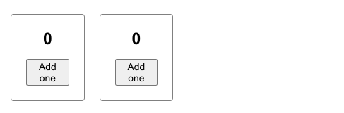
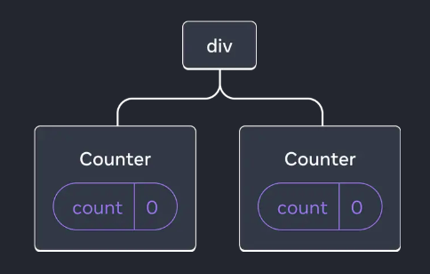
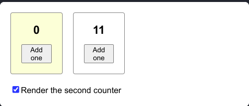
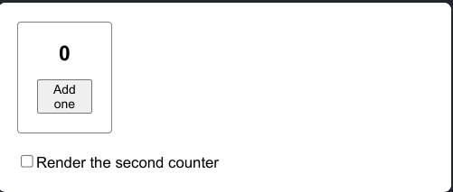
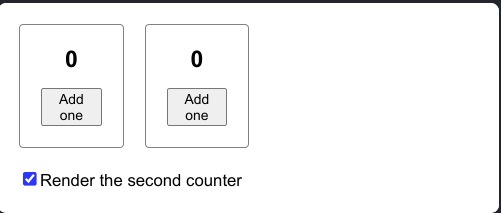
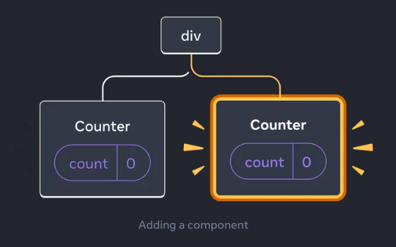

import { Callout } from "nextra/components";

### Preserving and Resetting State

রিয়াক্টের স্টেটগুলো তার কম্পোনেন্টের মধ্যে `isolated` থাকে, এবং রিয়াক্ট তার কম্পোনেন্টগুলোকে যখন রেন্ডার করে তখন সে তার কম্পোনেন্টগুলোকে তার রেন্ডার ট্রি তে কম্পোনেন্টগুলোর স্টেট সহ মনে রাখে, যাতে যখন প্রয়োজন সে চাইলে স্টেট রিসেট করতে পারে, অথবা চাইলে স্টেট রিসেট করতে পারে।

রিয়াক্ট কখন স্টেট প্রিসার্ভ করে আর কখন স্টেটগুলো রিসেট করে ফেলে,তা বিস্তারিত জেনে নেওয়া যাকঃ

**রিয়াক্ট মূলত তিনটা রুলস মানেঃ**

👉**1.State is tied to a position in the render tree (রিয়াক্টের স্টেটগুলো কম্পোনেটের পজিশনের সাথে যুক্ত থাকে)**

👉**2.Same component at the same position preserves state (সেম কম্পোনেন্ট সেম পজিশনে স্টেট ধরে রাখে)**

👉**3.Different components at the same position reset state (একই পজিশনে আলাদা আলাদা কম্পোনেন্ট আসলে স্টেট রিসেট হয়ে যায়)**

### State is tied to a position in the render tree

রিয়াক্ট তার কম্পোনেন্টগুলোকে রেন্ডার করার পর সকল কম্পোনেন্ট গুলোকে একটা ট্রি আকারে চিন্তা করে, এবং ট্রি এর প্রতিটা আলাদা আলাদা পজিশনে যেসব কম্পোনেন্ট গুলো আছে সেগুলোকেও সে সেই পজিশনের সাথে যুক্ত রাখে।

মানে হলো রিয়াক্টের রেন্ডার ট্রি এর আলাদা আলাদা পজিশনে যদি একই কম্পোনেন্ট রি-ইউজ করা হয়, তাতে কিন্তু আলাদা আলাদা পজিশন হউয়ার কারনে প্রতিটা পজিশনের কম্পোনেটের স্টেট টাও আলাদা হয়। এবং সেই কারণেই একটায় স্টেট চেঞ্জ করলেও অন্যটায় স্টেট চেঞ্জ হয়না।

```jsx filename= "App.jsx"
import { useState } from "react";

export default function App() {
    const counter = <Counter />;
    return (
        <div>
            {counter}
            {counter}
        </div>
    );
}

function Counter() {
    const [score, setScore] = useState(0);
    const [hover, setHover] = useState(false);

    let className = "counter";
    if (hover) {
        className += " hover";
    }

    return (
        <div
            className={className}
            onPointerEnter={() => setHover(true)}
            onPointerLeave={() => setHover(false)}>
            <h1>{score}</h1>
            <button onClick={() => setScore(score + 1)}>Add one</button>
        </div>
    );
}
```

উপরে একটা কাউন্টার কম্পোনেন্ট কে দুইবার রি-ইউজ করা হয়েছে,

```jsx
export default function App() {
    const counter = <Counter />;
    return (
        <div>
            {counter}
            {counter}
        </div>
    );
}
```

একানে একই কম্পোনেট দুইবার ব্যাবহার করা হলেও দুইটা কিন্তু দুই পজিশনে আছে, আমরা যদি উপরের কোডটার UI দেখি তাহলে এমন দেখতে পাবো

 এখানে দেখা যাচ্ছে দুইটা একই কম্পোনেট পাশাপাশি বসে আছে, পাশাপাশি বসে থাকলেও এই কম্পোনেট দুইটার রেন্ডার ট্রি-রিপ্রেজেটেশন হলো এমনঃ

 এখন তাহলে পরিষ্কার বুঝা যাচ্ছে যে, যদিও দুইটা একই কম্পোনেট কিন্তু রিয়াক্টের ট্রি তে তাদের পজিশন আলাদা আলাদা। আর এজন্যই একটা কম্পোনেন্টে স্টেট চেঞ্জ করলেও অন্য কম্পোনেন্টে কোন ধরনের কোন স্টেট পরিবর্তন হয়না। এজন্যই বলা হয় **`State is tied to a position`**

আমরা এটা আরও ভালো করে বুঝতে পারবো যদি নিচের উদাহরণগুলো একটু দেখি।

চলুন একটা চেকবক্স এড করি,যাতে আমরা চাইলে দ্বিতীয় কাউন্টার কম্পোনেন্টকে চাইলে রেন্ডার করতে পারি আবার চাইলে রিমুভ করে দিতে পারি।

```jsx filename="App.jsx"
import { useState } from "react";

export default function App() {
    const [showB, setShowB] = useState(true);
    return (
        <div>
            <Counter />
            {showB && <Counter />}
            <label>
                <input
                    type='checkbox'
                    checked={showB}
                    onChange={(e) => {
                        setShowB(e.target.checked);
                    }}
                />
                Render the second counter
            </label>
        </div>
    );
}

function Counter() {
    const [score, setScore] = useState(0);
    const [hover, setHover] = useState(false);

    let className = "counter";
    if (hover) {
        className += " hover";
    }

    return (
        <div
            className={className}
            onPointerEnter={() => setHover(true)}
            onPointerLeave={() => setHover(false)}>
            <h1>{score}</h1>
            <button onClick={() => setScore(score + 1)}>Add one</button>
        </div>
    );
}
```

আউটপুট:

 এখানে আমরা দুইটা কাউন্টারের সাথে একটা চেকবক্স দেখতে পাচ্ছি, আমরা কাউন্টারের স্টেট গুলো আপডেট করতে পারছি এবং চেকবক্স এ চাপ দিয়ে আনচেক করে দিলে দ্বিতীয় কাউন্টারটি রিমুভ হয়ে যাচ্ছে, এবং আবার চেক করলে চলে আসছে।





কিন্তু খেয়াল করুন দ্বিতীয়বার যখন কম্পোনেন্টটি ফেরত আসলো তখন কিন্তু তার স্টেট রিসেট হয়ে গেছে, তাহলে এটা কেন হলো ?

এটা এজন্য হলো যে, যখন চেকবক্স আনচেক করা হয়েছে তখন কম্পনেন্টটি তার পজিশন থেকে সমস্ত স্টেট সহ ডিলিট হয়ে গেছে, তাই দ্বিতীয়বার যখন আবার ফেরত আনা হচ্ছে তখন সে সম্পুর্ন নতুন কম্পোনেন্ট হয় আসছে।

একানে রেন্ডার ট্রি তে যা ঘটছে তা হলোঃ




অর্থাৎ কম্পোনেট ট্রি থেকে রিমুভ হয়ে গেলে ট্রি স্ট্রাকচার টা পরিবর্তন হয়ে যাচ্ছে, তাই কম্পোনেন্টের সকল স্টেট ডেস্ট্রয় হয়ে যাচ্ছে।

**সুতরাং কোন কম্পোনেন্ট যতক্ষণ তার নিজ পজিশনে বসে থাকে ততক্ষণ রিয়াক্ট স্টেট কে ধরে রাখে, যদি সেটি তার পজিশন থেকে রিমুভ হয়ে যায়,তাহলে স্টেট ও রিসেট হয় যায়।**

### Same component at the same position preserves state

একই কম্পোনেট যতক্ষণ তার একই পজিশনে বসে থাকবে ততক্ষণ সে তার নিজস্ব স্টেট ধরে রাখবে। যদি এমনও হয় যে আপনি প্যারেন্ট কম্পোনেন্ট থেকে কোন স্টেট চেঞ্জ করছেন বা কন্ডীশনালি কিছু করছেন তবুও সেই কম্পোনেন্ট যতক্ষন তার নিজস্ব পজিশনে বসে থাকবে,ততক্ষণ সে তার লোকাল স্টেট ধরে রাখবে।

```jsx filename="App.jsx"
import { useState } from "react";

export default function App() {
    const [isFancy, setIsFancy] = useState(false);
    return (
        <div>
            {isFancy ? <Counter isFancy={true} /> : <Counter isFancy={false} />}
            <label>
                <input
                    type='checkbox'
                    checked={isFancy}
                    onChange={(e) => {
                        setIsFancy(e.target.checked);
                    }}
                />
                Use fancy styling
            </label>
        </div>
    );
}

function Counter({ isFancy }) {
    const [score, setScore] = useState(0);
    const [hover, setHover] = useState(false);

    let className = "counter";
    if (hover) {
        className += " hover";
    }
    if (isFancy) {
        className += " fancy";
    }

    return (
        <div
            className={className}
            onPointerEnter={() => setHover(true)}
            onPointerLeave={() => setHover(false)}>
            <h1>{score}</h1>
            <button onClick={() => setScore(score + 1)}>Add one</button>
        </div>
    );
}
```

উপরের এই কোডে একটা কাউন্টার কম্পোনেন্টকে একটা কন্ডিশন দিয়ে রেন্ডার করা হয়েছে,

```jsx
const [isFancy, setIsFancy] = useState(false);

isFancy ? <Counter isFancy={true} /> : <Counter isFancy={false} />;
```

এখানে দেখা যাচ্ছে যে একটি `isFancy` স্টেট এর উপর বেস করে এখানে কন্ডিশনালি কম্পোনেন্ট কে রেন্ডার করা হয়েছে, এবং একটা চেকবক্স রাখা হয়েছে যেখানে ক্লিক করলে `isFancy` এই স্টেট টার ভ্যালু চেঞ্জ হয়।

এখন স্বাভাবিকভাবে মনে হতে পারে যখন চেকবক্স এ ক্লিক করা হবে তখন আগের কম্পোনেন্ট রিমুভ হয়ে নতুন কম্পোনেন্ট আসবে এবং তার স্টেট রিসেট হয়ে যাবে।

কিন্তু না, তা হবেনা । কেননা কন্ডিশনালি প্রপ্স চেঞ্জ হলেও একই কাউন্টার কম্পোনেন্ট কিন্তু রেন্ডার ট্রি এর একই পজিশনে আছে। তাই তার স্টেট রিসেট হবেনা।

<Callout
    type='warning'
    emoji='📔'>
    আমরা যখন পজিশনের কথা বলছি,মনে রাখতে হবে এটা হলো রিয়াক্ট এর রেন্ডার ট্রি। এটা
    কিন্তু `JSX` ট্রি নয়। যতক্ষণ পর্যন্ত রিয়াক্ট এর রেন্ডার ট্রি-তে কোন পরিবর্তন
    না হবে ততক্ষণ সে কম্পোনেন্টগুলোর স্টেট ধরে রাখবে, যদি কোন কম্পোনেন্ট রিয়াক্ট
    এর রেন্ডার ট্রি থেকে রিমুভ হয় বা কোনকারনে ওই পজিশনে অন্য কোন কম্পোনেন্ট বসে
    তাহলে সেই কম্পোনেন্টের স্টেট রিসেট হয়ে যাবে।
</Callout>

### Different components at the same position reset state

একই পজিশনে যদি আগের রেন্ডারে যেই কম্পোনেন্ট ছিল, পরের রেন্ডারে সেই কম্পোনেন্ট না থাকে, বা পরের রেন্ডারে ওই পজিশনে অন্য কোন কম্পোনেন্ট বসে তাহলে রিয়াক্ট স্টেট রিসেট করে দেয়।

```jsx
import { useState } from "react";

export default function App() {
    const [isPaused, setIsPaused] = useState(false);
    return (
        <div>
            {isPaused ? <p>See you later!</p> : <Counter />}
            <label>
                <input
                    type='checkbox'
                    checked={isPaused}
                    onChange={(e) => {
                        setIsPaused(e.target.checked);
                    }}
                />
                Take a break
            </label>
        </div>
    );
}

function Counter() {
    const [score, setScore] = useState(0);
    const [hover, setHover] = useState(false);

    let className = "counter";
    if (hover) {
        className += " hover";
    }

    return (
        <div
            className={className}
            onPointerEnter={() => setHover(true)}
            onPointerLeave={() => setHover(false)}>
            <h1>{score}</h1>
            <button onClick={() => setScore(score + 1)}>Add one</button>
        </div>
    );
}
```

এখানে খেয়াল করলে দেখবেন যে,

```jsx {1,4}
    const [isPaused, setIsPaused] = useState(false);
    return (
        <div>
            {isPaused ? <p>See you later!</p> : <Counter />}
            <label>
                <input
                    type='checkbox'
                    checked={isPaused}
                    onChange={(e) => {
                        setIsPaused(e.target.checked);
                    }}
                />
                Take a break
            </label>
        </div>
```

এখানে কন্ডিশনালি একই পজিশনে দুইটা কম্পোনেন্ট দেখানো হচ্ছে, যখন চেকবক্স এ ক্লিক করা হচ্ছে তখন কাউন্টার কম্পোনেন্ট এর পজিশনে একটা `<p>...</p>` ট্যাগ বসছে, যখনি `<p>...</p>` ট্যাগ বসছে,তখনি দ্বিতীয় রেন্ডারে রিয়াক্ট তার রেন্ডার ট্রি এর ওই পজিশনে আর কাউন্টারকে পাচ্চেনা,তাই কাউন্টার কম্পোনেন্ট রিমুভ হওয়ার সাথে সাথে তার স্টেট সহ রিসেট হয়ে যাচ্ছে। তাই পরেরবার আবার যখন চেকবক্স আনচেক করে কাউন্টার কম্পোনেন্ট আবার আনা হচ্ছে, তখন সে একটা ফ্রেশ কম্পোনেন্ট হিসেবে আসছে।

**সর্বশেষে মোট কথা হলো যদি একটা রেন্ডার থেকে পরবর্তি রেন্ডারে কম্পোনেন্টগুলোর স্টেট ধরে রাখতে হয়, তাহলে রেন্ডার ট্রি এর স্ট্রাকচার দুইটা রেন্ডারেই সেম থাকতে হবে।**

