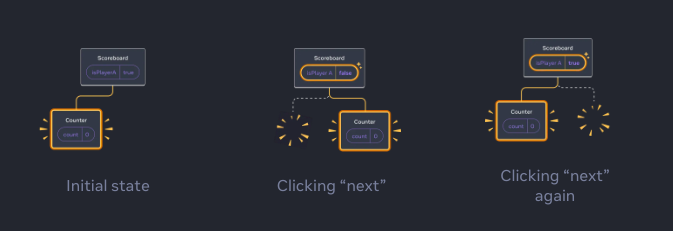

### Resetting state at the same position

**আমরা জানি কোন কম্পনেন্ট একই পজিশনে যতক্ষণ থাকবে ততক্ষণ রিয়াক্ট তার স্টেট ধরে রাখবে।**

কিন্তু যদি আমাদের এমন প্রয়োজন হয় যে আমরা একই পজিশনে কম্পনেন্টের স্টেট রিসেট করবো। তাহলে দুইটা উপায়ে আমরা সেটা করতে পারিঃ

1.  Rendering a component in different positions
2.  Give each component an explicit identity with `key`

#### Rendering a component in different positions

```jsx filename="App.jsx"
import { useState } from "react";

export default function Scoreboard() {
    const [isPlayerA, setIsPlayerA] = useState(true);
    return (
        <div>
            {isPlayerA ? (
                <Counter person='Taylor' />
            ) : (
                <Counter person='Sarah' />
            )}
            <button
                onClick={() => {
                    setIsPlayerA(!isPlayerA);
                }}>
                Next player!
            </button>
        </div>
    );
}

function Counter({ person }) {
    const [score, setScore] = useState(0);
    const [hover, setHover] = useState(false);

    let className = "counter";
    if (hover) {
        className += " hover";
    }

    return (
        <div
            className={className}
            onPointerEnter={() => setHover(true)}
            onPointerLeave={() => setHover(false)}>
            <h1>
                {person}'s score: {score}
            </h1>
            <button onClick={() => setScore(score + 1)}>Add one</button>
        </div>
    );
}
```

এখানে একটা কম্পোনেন্টে প্লেয়ারের স্কোর কাউন্ট করা হচ্ছে, আমরা যখন `Add One` বাটনে চাপ দিয়ে স্কোর বারাচ্ছি,তখন স্কোর এর স্টেট চেঞ্জ হচ্ছে, আবার আমরা নিচে একটা বাটন রেখেছি `Next Player` নামে, এবং আমরা চাইছি যে বাটনে চাপ দিলে প্লেয়ার এর নাম চেঞ্জ হবে এবং স্কোরটা রিসেট হয়ে যাবে। কিন্তু এখানে সেটা হচ্ছেনা, কারণ হলো এখানে একই পজিশনে কাউন্টার কম্পোনেন্ট তার পজিশনে ধরে রেখছে,তাই স্টেট রিসেট হচ্ছে।

কিন্তু যদি আমরা কোডটা এভাবে লিখি,

```jsx
// প্রথম কোড যা স্টেট ধরে রাখবে
{
    isPlayerA ? <Counter person='Taylor' /> : <Counter person='Sarah' />;
}
```

```jsx
{
    isPlayerA && <Counter person='Taylor' />; // এখানে যদি isPlayerA না হয় তাহলে এই পজিশনে null রিটার্ন হবে
}
{
    !isPlayerA && <Counter person='Sarah' />; // এখানে যদি isPlayerA হয় তাহলে এই পজিশনে null রিটার্ন হবে
}
```

একানে রেন্ডার ট্রি-এর স্ট্রাকচার টা হয় এমনঃ 

তাহলে দেখা যাচ্ছে যে `isPlayerA` না হয় তাহলে নিচের কম্পোনেন্ট রেন্ডার হবে। এখানে কিন্তু দুইটা কম্পোনেন্ট দুইটা আলাদা পজিশনে আছে, কেননা একটা যদি `true` না হয় সেই পজিশনে কিন্তু একটা `null` রিটার্ন হয়, এবং অন্য কম্পোনেন্ট টা আলাদা একটা পজিশনে রেন্ডার হয়।

#### Resetting state with a `key`

আরেকটা সবচাইতে এফিসিয়েন্ট উপায় হলো `key` প্রপ্স ব্যাবহার করা, আমরা লিস্ট রেন্ডার করার সময় `key`প্রপ্স এর সাথে পরিচিত হয়েছিলাম,

`key` প্রপ্স শুধুমাত্র লিস্ট রেন্ডারিং এর জন্য ব্যবহার হয়না। `key` প্রপ্স এর মানে হলো সেই কম্পোনেন্টকে রিয়াক্টের কাছে একটা আলাদা কম্পোনেন্ট হিসেবে রিপ্রেজেন্ট করা।

তাই আমরা যদি আগের মতো করেই কোড করি এবং শুধু স্টেটগুলো রিসেট করতে চাই তাহলে আমরা এভাবে `key` প্রপ্স ব্যাবহার করতে পারি।

```jsx
{
    isPlayerA ? (
        <Counter
            key='Taylor'
            person='Taylor'
        />
    ) : (
        <Counter
            key='Sarah'
            person='Sarah'
        />
    );
}
```

এখানে `key` প্রপ্স এর মানে হলো একই পজিশনে দুইটা সম্পুর্ন আলাদা কম্পোনেন্ট ।

