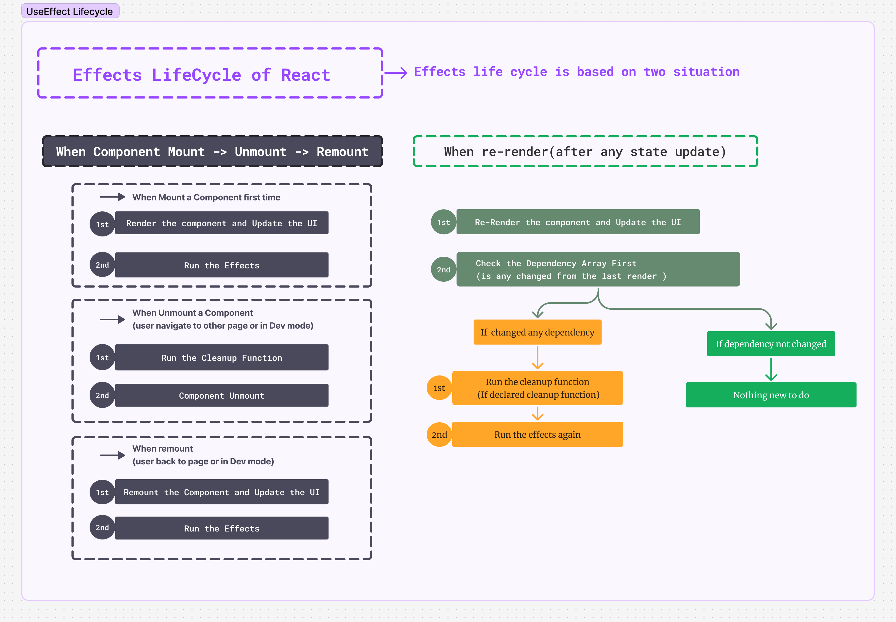

### The lifecycle of an Effect

রিয়াক্টের প্রতিটা কম্পনেন্ট সেম লাইফ সাইকেলের ভিতর দিয়ে যায়,

-   **মাউন্টঃ** কম্পোনেন্ট প্রথমে মাউন্ট হয় এবং স্ক্রিনে ভিজিবল হয়।
-   **আপডেটঃ** প্রপ বা স্টেট চেঞ্জ এর উপর ভিত্ত করে কম্পোনেন্ট আপডেট হয়।
-   **আনমাউন্টঃ** যখন স্ক্রিন থেকে রিমোভ করা হয় বা ইউজার নেভিগেট করে অন্য পেজে যায় তখন কম্পোনেন্ট আনমাউণ্ট হয়।

রিয়াক্টের কম্পোনেন্টের ক্ষেত্রে এভাবে ভাবলে ঠিক আছে, কিন্তু ইফেক্টের লাইফসাইকেল কিন্তু এভাবে নয়। প্রতিটা ইফেক্ট কম্পোনেন্টের লাইফসাইকেল থেকে আলাদা। ইফেক্ট কম্পোনেন্টের স্টেট বা প্রপ এর সাথে এক্সটারনাল সার্ভারের `Syncronize` করে থাকে, তাই যখনি আমাদের কোড চেঞ্জ হতে থাকে তখন `Syncronization` টাও একাধিকবার দরকার হয়।

চলুন একটু উদাহরণের মাধ্যমে বুঝি,

ধরে নেই আমাদের এই কোড একটা এক্সটারনাল চ্যাট সার্ভারের সাথে কানেক্ট করে।

```jsx
const serverUrl = "https://localhost:1234";

function ChatRoom({ roomId }) {
    useEffect(() => {
        const connection = createConnection(serverUrl, roomId);
        connection.connect();
        return () => {
            connection.disconnect();
        };
    }, [roomId]);
    // ...
}
```

এখানে ইফেক্টের বডিতে বলা হয়েছে কিভাবে চ্যাট সার্ভারের সাথে কানেকশন ঘটাবে,

```jsx {2-3}
// ...
const connection = createConnection(serverUrl, roomId);
connection.connect();
return () => {
    connection.disconnect();
};
// ...
```

আর এখানে ক্লিন-আপের মধ্যে বলা হয়েছে কিভাবে কানেকশন স্টপ করবে,

```jsx {4-6}
// ...
const connection = createConnection(serverUrl, roomId);
connection.connect();
return () => {
    connection.disconnect();
};
// ...
```

সাধারণভাবেই আপনি ভাবতে পারেন যে এখানে যখন কম্পোনেন্ট মাউট হবে তখন ইফেক্টের মাধ্যমে কানেশন স্টার্ট হবে এবং যদি কম্পোনেন্ট আনমাউন্ট হয় তাহলে কানেকশন স্টপ হয়ে যাবে।

কিন্তু এখানেই কিন্তু সবকিছু শেষ না, আমদের কম্পোনেন্ট মাউন্ট থাকা অবস্থায় আমাদের আরও একাধিকবার সার্ভারের সাথে `Syncronization` দরকার হতে পারে।

#### Why synchronization may need to happen more than once (কেন একাধিকবার `Syncronization` দরকার হবে ?)

মনে করুন `ChatRoom` কম্পোনেন্ট তার প্রপ্স হিসেবে একটা `roomId` নেয় এবং যখনি `roomId` চেঞ্জ হয় তখনি কম্পোনেন্ট কে নতুন নতুন চ্যাটরুমের সাথে কানেক্টেড করতে হয়। ধরে নেন `roomId` গুলো ইউজার কোন সিলেক্ট অপশন থেকে সিলেক্ট করতে পারবে,

এখন ধরুন প্রথমবার ইউজার সিলেক্ট অপশন থেকে `General` সিলেক্ট করলো এবং তাতে প্রথমে UI তে `General` চ্যাটরুম টা ভিজিবল হলো।

```jsx
const serverUrl = "https://localhost:1234";

function ChatRoom({ roomId /* "general" */ }) {
    // ...
    return <h1>Welcome to the {roomId} room!</h1>;
}
```

তারপর ইফেক্ট জেনারেল রুমের সাথে কানেকশন স্টার্ট করলো। এর মধ্যেই আবার ইউজার `Travel` চ্যাটরুম সিলেক্ট করলো এবং তাতে স্টেট চেঞ্জ হলো এবং প্রপ হিসেবে একটা নতুন `roomId` আসলো, এতে প্রথমে UI তে `Travel` চ্যাটরুম দেখানো হবে।

কিন্তু এখনও কিন্তু আমাদের ইফেক্ট `General` চ্যাট সার্ভারের সাথেই কানেক্টেড হয়ে আছে, তাহলে এবার এখানে কিন্তু ইফেক্টকে `re-Syncronize` হতে হবে এবং `general` চ্যাট সার্ভার থেকে ডিসকানেন্ট হয়ে `Travel` চ্যাট সার্ভারের সাথে কানেক্ট হতে হবে।

#### How React re-synchronizes your Effect (রিয়াক্ট কিভাবে ইফেক্ট কে `re-Syncronize` করে)

ইফেক্ট তার ডিপেন্ডেন্সি হিসেবে একটা Array আকারে কিছু রিয়াক্টিভ ভ্যালু নেয়, যেগুলো চেঞ্জ হলে রিয়াক্ট নিজেই ডিসিশন নেয় তাকে কি করতে হবে। যখন স্টেট চেঞ্জ এর কারনে কম্পোনেন্ট রি-রেন্ডার হয় এবং নতুন ভ্যালু পায়, তখন কম্পোনেন্ট প্রথমে UI তে আপডেট হয়, তারপর ইফেক্ট রান হয়। ইফেক্ট রান হউয়ার আগে সে চেক করে তার ডীপেন্ডেসি Array-এর কোন ভ্যালু সেকেন্ড রেন্ডারে চেঞ্জ হয়েছে কিনা, যদি চেঞ্জ হয় তাহলে সে প্রথমে প্রথম রেন্ডারের `Syncronization` টা স্টপ করে দেয়, এবং তারপর আবার নতুন করে ইফেক্ট রান করে।

```jsx
const serverUrl = "https://localhost:1234";

function ChatRoom({ roomId }) {
    useEffect(() => {
        const connection = createConnection(serverUrl, roomId);
        connection.connect();
        return () => {
            connection.disconnect();
        };
    }, [roomId]);
    // ...
}
```

#### রিয়াক্টের ইফেক্টের লাইফসাইকেলের চিত্রঃ



### Each Effect represents a separate synchronization process (আলাদা আলাদা ইফেক্ট আলাদা আলাদা `Syncronization` কে রিপ্রেজেন্ট করে)

একই সাথে রিলেটেড ফিচারগুলো আমরা একটা ইফেক্টে ম্যানেজ করতে পারি, কিন্তু যদি এমন হয় যে আমাদের আলাদা আলাদা ফিচার ইমপ্লিমেন্ট করা লাগবে তাহলে আমরা আলাদা আলাদা ইফেক্টে সেগুলো ম্যানেজ করতে পারি।
