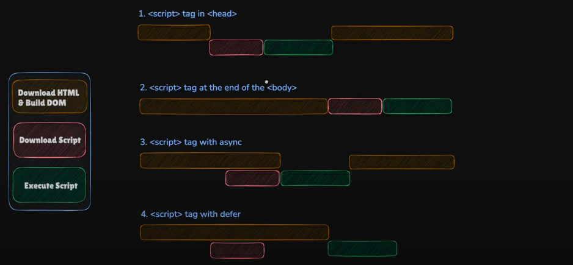
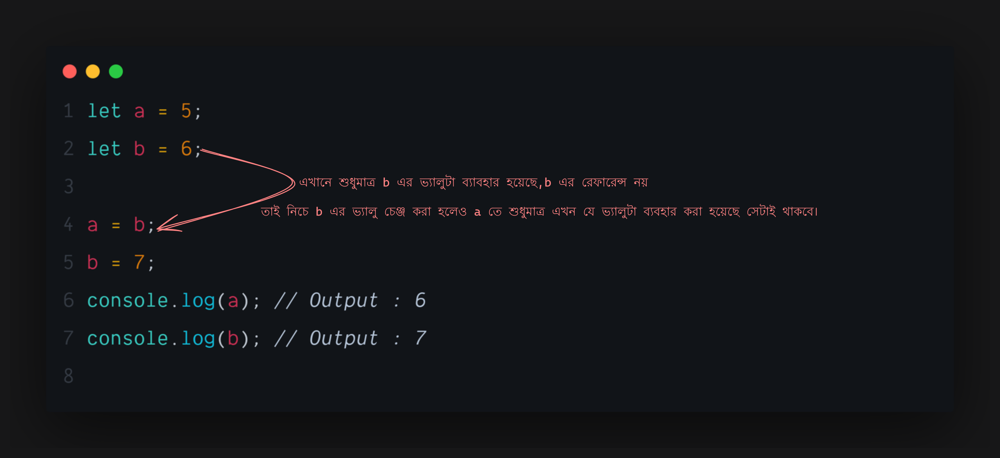
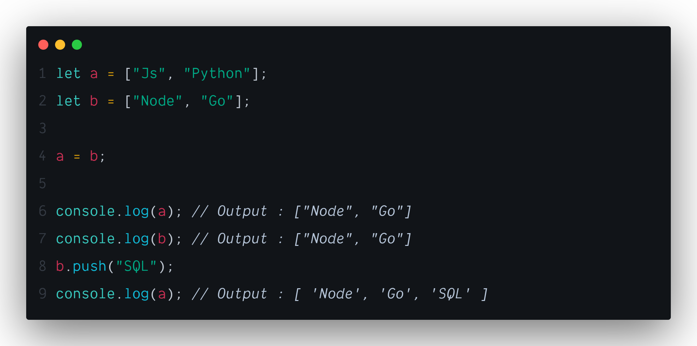
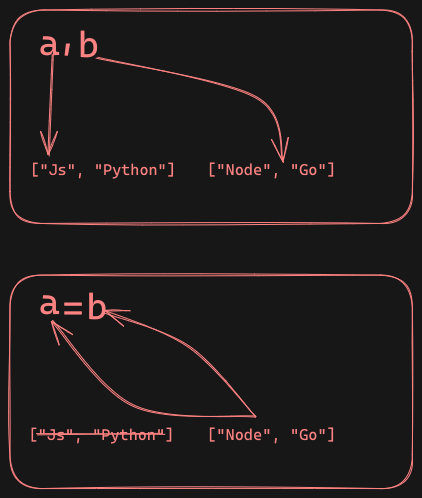

import { Callout } from "nextra/components";

## Setting Up JavaScript - "JavaScript" in `html` file

### Where to put `<script>` tag in html `head`/`body

HTML এর মধ্যে JavaScript চালানোর জন্য `<script>` ট্যাগ ব্যবহার করা হয়। JavaScript কোড আমরা লিখতে পারি দুইভাবে:

1. **Inline JavaScript** (HTML ফাইলের ভেতরেই কোড)
2. **External JavaScript** (আলাদা `.js` ফাইলে রেখে `src` দিয়ে লিঙ্ক করা)

---

## Script Tag কোথায় বসাবো?

### Option 1: `<head>` এর ভেতরে

```html
<!DOCTYPE html>
<html>
    <head>
        <script src="script.js"></script>
    </head>
    <body>
        <h1>Hello World</h1>
    </body>
</html>
```

**সমস্যা কী?**

-   যখন browser HTML পড়ে `<script>` দেখে, তখন সেটা লোড এবং চালানো শুরু করে।
-   JS ফাইল লোড হওয়া পর্যন্ত HTML parsing বন্ধ থাকে। এটাকে বলা হয় Render Blocking।
-   যদি JS DOM-এ কিছু access করতে চায় (যেমন document.getElementById) — তখন সেটা কাজ করবে না কারণ HTML এখনো পুরো লোড হয়নি।

**ব্যবহার করবেন না যদি DOM access করতে হয়!**

### Option 2: `<body>` এর শেষে (before `</body>`)

```html
<!DOCTYPE html>
<html>
    <head>
        <title>My Page</title>
    </head>
    <body>
        <h1>Hello World</h1>
        <script src="script.js"></script>
    </body>
</html>
```

**এটা সবচেয়ে জনপ্রিয় ও সহজ উপায়**

-   HTML আগে parse হয়, তারপর JS চলে
-   DOM পুরো available থাকে
-   JS সব element access করতে পারে
-   No render blocking → faster page load

## async vs defer: কী কাজ করে কীভাবে?

`<script>` ট্যাগে async বা defer attribute দিলে, JavaScript execution control করা যায়।

### async

```html
<script src="script.js" async></script>
```

**কিভাবে কাজ করে?**

-   Script HTML এর সাথে সাথে লোড হয় (non-blocking)
-   কিন্তু লোড হতেই সাথে সাথে execute হয়
-   DOM এখনও পুরো load না হলেও JS চলে যেতে পারে

**সমস্যাঃ**

-   যদি DOM element access করে, তখন error আসতে পারে
-   multiple async script থাকলে execution order এলোমেলো হতে পারে

### defer

```html
<script src="script.js" defer></script>
```

**কিভাবে কাজ করে?**

-   HTML parse করার সময়েই script লোড হয় (non-blocking)
-   কিন্তু execute করে DOM parse শেষ হওয়ার পরেই
-   multiple defer script থাকলে যে order এ লেখা হয়েছে, সেই order এ চলে

**Best practice:**

-   নিজের JavaScript file → defer ব্যবহার করো
-   DOM access করতে হলে defer always safe

## তুলনামূলক টেবিল: async vs defer

| Feature          | async                             | defer                           |
| ---------------- | --------------------------------- | ------------------------------- |
| Load behavior    | HTML parse এর সাথে সাথে লোড হয়   | HTML parse এর সাথে সাথে লোড হয় |
| Execute behavior | Load হওয়া মাত্র execute হয়      | DOM parse শেষ হলে execute হয়   |
| Execution Order  | যেভাবেই লোড হয়, সেইভাবে চলে      | HTML এ যেভাবে লেখা, সেইভাবে চলে |
| DOM ready time   | DOM এর আগে execute হতে পারে       | DOM parse শেষ হওয়ার পর চলে     |
| Use Case         | Third-party script, ads, tracking | Page এর নিজস্ব scripts          |

## Visual Diagram: Execution Flow

```
No attribute:
HTML -----[BLOCK]-- JS --[RESUME]--> DOM

async:
HTML -----⟶⟶ [JS loaded & executed immediately] ⟶⟶ DOM continues

defer:
HTML ⟶⟶ [JS loaded in background] ⟶⟶ DOM parsed completely ⟶⟶ [JS executed in order]
```

## কখন কী ব্যবহার করবো?

| Scenario                                    | Suggested Script Setup                    |
| ------------------------------------------- | ----------------------------------------- |
| Simple demo/test project                    | `<script>` at end of `<body>`             |
| DOM access needed before running script     | defer (in `<head>`)                       |
| Tracking or analytics script (e.g., Google) | async                                     |
| Multiple dependent JS files                 | defer maintains order                     |
| Using modern frameworks like React/Vue      | Usually handled via build tools (Webpack) |

## Bonus: Inline Script + DOM Ready

যদি inline JS লেখো এবং `<head>` এ রাখতে চাও, তাহলে DOM ready হবার event শুনতে হবে:

```html
<script>
    document.addEventListener("DOMContentLoaded", function () {
        // All DOM elements are ready
        const heading = document.querySelector("h1");
        heading.textContent = "Hello from JS!";
    });
</script>
```

## Best Practices Summary

-   Use `<script src="app.js" defer></script>` inside `<head>` → most modern and safe
-   Or, use `<script>` just before closing `</body>` tag
-   Avoid placing blocking `<script>` inside `<head>` unless absolutely necessary
-   Use async only for third-party independent scripts

## Final Example: Best Setup for Beginners

```html
<!DOCTYPE html>
<html>
    <head>
        <meta charset="UTF-8" />
        <title>Best JS Setup</title>
        <script src="main.js" defer></script>
    </head>
    <body>
        <h1>Welcome to JavaScript</h1>
    </body>
</html>
```

```javascript
// main.js
document.addEventListener("DOMContentLoaded", () => {
    const h1 = document.querySelector("h1");
    h1.textContent = "JavaScript is Working!";
});
```



অর্থাৎ `html` এর `head` এর ভিতর `defar` attribute দিয়ে `script` লোড করা সবচাইতে ভালো।
এটা `DOM` এর জন্য সেফ এবং `render blocking` হয়না।

---

## Scope in JavaScript

## Primitive and Reference types Value

### Primitive

প্রিমিটিভ এর বাংলা অর্থ হলো `আদিম`। জাভাস্ক্রিপ্টে যেসব DATATYPE আছে যেমনঃ

-   String
-   Number
-   BigInt
-   Boolean
-   Null
-   Undefined
-   Symbol

এইগুলো হলো জাভাস্ক্রিপ্টের মূল বা একক। এগুলো ব্যাবহার করে অন্যান্য ডাটা বানানো হয়। এগুলোকে বলা হয় প্রিমিটিভ ডাটা বা ভ্যালু ।

### References

জাভাস্ক্রিপ্টের `Array` এবং `Object` কে বলা হয় রেফারেন্স টাইপ ডাটা বা ভ্যালু ।

### প্রিমিটিভ এবং রেফারেন্স টাইপ ডাটার পার্থক্যঃ

প্রিমিটিভ এবং রেফারেন্স টাইপ ডাটার মধ্যে মূল যেই পার্থক্য রয়েছে তা হলো এর ডাটার বিহেবিয়ার নিয়ে। যেমন নিচে উদাহরণের মাধ্যমে বুঝানো হলোঃ

### Primitive



প্রিমিটিভ ডাটা শুধুমাত্র ভ্যালুটা শেয়ার করে। ডাটার রেফারেন্স শেয়ার করেনা।

### Reference



এখানে `a` কে যখন `b` দ্বারা রি-এসাইন করা হয়েছে তখন স্বাভাবিক ভাবেই আ এর ভ্যালু চেঞ্জ হয়ে `b` এর যেই ভ্যালু ছিল তা হয়ে গিয়েছে। কিন্তু নিচে যখন `b` এর ভ্যালু চেঞ্জ করা হয়েছে সেই চেঞ্জটা `a` তেও এসে প্রভাব ফেলেছে এবং `a` সহ চেঞ্জ হয়ে গেছে। কারণ এখানে `a` তে যখন `b` এসাইন করা হয়েছিল তখন `a` তে `b` এর রেফারেন্স সহ চলে গেছিল,তাই যেকোন একটা কে চেঞ্জ করলেই দুইটাই চেঞ্জ হয়ে যাচ্ছে।

এখানে যেই বিষয়টা হয়েছে তা হলোঃ



`a` আর `b` যখন ডিফাইন করা হয়েছে তখন মেমরিতে দুইটা `Array` এলোকেটেড করা হয়েছে এবং `Array` দুটি তাদের যেই `Variables` এর নাম `a` এবং `b` তার দিয়ে পয়েন্ট করে আছে। কিন্তু যখন `a = b` করা হয়েছে তখন দুইটা পয়েন্টার এক হয়ে `b` এর ভ্যালু থেকে `a` আর `b` এর দিকে পয়েন্ট হয়ে গেছে। তাই এখন `a` অথবা `b` যেইটাই চেঞ্জ করা হউক না কেন তা দুইটাকেই চেঞ্জ করবে।

এটাই হলো `primitives` আর `References` ভ্যালুর মধ্যে মূল পার্থক্য । তাছাড়াও আরো কিছু পার্থক্য রয়েছে তার ভিতরে এর স্টোরেজ লোকেশন এবং মেমরি এলোকেশন অন্যতম।

**Memory Allocation**

দুই ধরনের মেমোরিতে জাভাস্ক্রিপ্টের ডাটা স্টোর হয়।
১। Stack Memory
২। Heap Memory
`Stack Memory` হলো প্রিমিটিভ ডাটার জন্য এবং `Heap Memory` হলো রেফারেন্স টাইপ ডাটার জন্য।
`Heap Memory`এলোকেটেড হয় ডাইনামিক্যালি। অর্থাৎ যখনই প্রয়োজন হয় তখনই মেমোরি এলোকেটেড হয় এবং যখন প্রয়োজন শেষ হয়ে যায় তখন মেমোরি ফ্রি করে দেয়া হয়। সেজন্য `Heap Memory` প্রতিটা মেমরি এলোকেশনের সময় একটা ইউনিক এইডেন্টিফায়ার ব্যাবহার হয়। যাতে সেই আইডেন্টিফায়ার দিয়ে সেই মেমরিকে ট্র্যাক করা যায়। কিন্তু `Stack Memory` হলো স্ট্যাটিক। অর্থাৎ যখনই প্রোগ্রাম রান হবে তখনই মেমোরি এলোকেটেড হবে এবং প্রোগ্রাম শেষ হলে মেমোরি ফ্রি হয়ে যাবে।

## Shallow Copy Vs Deep Copy

জাভাস্ক্রিপ্টে "শ্যালো কপি" (Shallow Copy) এবং "ডিপ কপি" (Deep Copy) হল দুটি আলাদা প্রক্রিয়া যেগুলো ব্যবহার করে একটি `Object` বা `Array`'র কপি তৈরি করা হয়। তবে এদের মধ্যে বড় পার্থক্য হচ্ছে কিভাবে ডেটা কপি করা হয়। নিচে প্রতিটি কনসেপ্ট বিস্তারিতভাবে ব্যাখ্যা করছি:

### শ্যালো কপি (Shallow Copy)

শ্যালো কপিতে কেবলমাত্র অবজেক্টের প্রথম লেভেলের ভ্যালুগুলি কপি করা হয়। এর মানে হলো, যদি অবজেক্ট বা আরে'র মধ্যে নেস্টেড অবজেক্ট থাকে, তাহলে সেগুলি রেফারেন্স হিসেবে কপি হয়। অর্থাৎ, নেস্টেড অবজেক্ট বা আরে'র জন্য একটি রেফারেন্স তৈরি হয়, নতুন অবজেক্টে একই ডেটা শেয়ার করে।

#### উদাহরণ:

```javascript showlineNumbers
let originalArray = [1, 2, { a: 3, b: 4 }];

// শ্যালো কপি তৈরি করা
let shallowCopy = [...originalArray];

console.log(shallowCopy); // [1, 2, { a: 3, b: 4 }]

// নেস্টেড অবজেক্ট পরিবর্তন করা
shallowCopy[2].a = 10;

console.log(originalArray); // [1, 2, { a: 10, b: 4 }]
console.log(shallowCopy); // [1, 2, { a: 10, b: 4 }] // নেস্টেড অবজেক্ট রেফারেন্স একারে কপি হওয়ার কারনে কপি ডাটাতে চেঞ্জ করলেও তা মেইন ডাটাকেও চেঞ্জ করে দিয়েছে।
```

এই উদাহরণে দেখা যাচ্ছে যে, `originalArray` এবং `shallowCopy` একই নেস্টেড অবজেক্ট শেয়ার করছে। যখন `shallowCopy[2].a` পরিবর্তন করা হয়, তখন মূল অবজেক্টেও পরিবর্তন ঘটে। এটি শ্যালো কপির একটি সীমাবদ্ধতা।

#### শ্যালো কপি তৈরি করার পদ্ধতি:

-   Spread Operator: `let copy = [...array];`

### ডিপ কপি (Deep Copy)

ডিপ কপিতে একটি অবজেক্টের প্রতিটি লেভেলের কপি তৈরি করা হয়, এমনকি নেস্টেড অবজেক্টেরও আলাদা কপি করা হয়। এর ফলে মূল অবজেক্টের কোনো পরিবর্তন নতুন কপি অবজেক্টকে প্রভাবিত করে না এবং বিপরীতও ঘটে না।

#### উদাহরণ:

```javascript showlineNumbers
let originalArray = [1, 2, { a: 3, b: 4 }];

// ডিপ কপি তৈরি করা (JSON পদ্ধতি ব্যবহার করে)
let deepCopy = JSON.parse(JSON.stringify(originalArray));

console.log(deepCopy); // [1, 2, { a: 3, b: 4 }]

// নেস্টেড অবজেক্ট পরিবর্তন করা
deepCopy[2].a = 10;

console.log(originalArray); // [1, 2, { a: 3, b: 4 }]
console.log(deepCopy); // [1, 2, { a: 10, b: 4 }]
```

এখানে দেখা যাচ্ছে যে, `deepCopy[2].a` পরিবর্তন করার পরেও `originalArray` এর নেস্টেড অবজেক্ট অপরিবর্তিত রয়েছে। কারণ, ডিপ কপিতে নেস্টেড অবজেক্টের নতুন কপি তৈরি হয়।

#### ডিপ কপি তৈরি করার পদ্ধতি:

-   1.  `JSON.parse(JSON.stringify(obj))`: সহজ পদ্ধতি, তবে ফাংশন ও undefined হ্যান্ডেল করতে পারে না।

-   2. Lodash লাইব্রেরির cloneDeep মেথড Lodash একটি জনপ্রিয় জাভাস্ক্রিপ্ট লাইব্রেরি, যা অনেক ধরনের ইউটিলিটি ফাংশন সরবরাহ করে। cloneDeep হল একটি বিশেষ মেথড যা ডিপ কপি তৈরি করতে পারে।

উদাহরণ:

প্রথমে lodash ইনস্টল করতে হবে:

```bash
 npm i --save lodash
```

তারপর

```javascript showlineNumbers
const _ = require("lodash");

let originalObject = { a: 1, b: { c: 2, d: 3 } };
let deepCopiedObject = _.cloneDeep(originalObject);

deepCopiedObject.b.c = 10;

console.log(originalObject); // { a: 1, b: { c: 2, d: 3 } }

console.log(deepCopiedObject); // { a: 1, b: { c: 10, d: 3 } }
```

**Lodash এর cloneDeep মেথড সমস্ত ডেটা টাইপ এবং নেস্টেড অবজেক্ট সঠিকভাবে হ্যান্ডেল করতে পারে। এটি ফাংশন, তারিখ, Map, Set এবং অন্যান্য জটিল ডেটা স্ট্রাকচার হ্যান্ডেল করার ক্ষেত্রে খুবই কার্যকর।**

### শ্যালো কপি বনাম ডিপ কপি পার্থক্য:

| **শ্যালো কপি**                               | **ডিপ কপি**                                |
| -------------------------------------------- | ------------------------------------------ |
| শুধুমাত্র প্রথম লেভেলের কপি করে।             | প্রতিটি লেভেলের জন্য নতুন কপি তৈরি করে।    |
| নেস্টেড অবজেক্টগুলো রেফারেন্স হিসেবে কপি হয়। | নেস্টেড অবজেক্টগুলোর সম্পূর্ণ নতুন কপি হয়। |

এই দুই ধরনের কপির মধ্যে পার্থক্য নির্ভর করে আপনার প্রয়োজনের উপর।

# Advanced JavaScript

## `this` এর ব্যাবহার। কোথায় এবং কিভাবে ।

### Implicit Binding

**`👉রুলসঃ` দেখতে হবে যে,ফাংশন কল হয়েছে কোথায়, যেখানে কল হয়েছে তার সামনে কি কোন ডট আছে কিনা,যদি থাকে তাহলে তার সামনে কি আছে। যদি কিছু থাকে তাহলে সেটাই হলো `this` । এক্ষেত্রে এক্সেপ্সন হলো `this` শুধু নরমাল ফাংশনেই কাজ করবে। কিন্তু `Arrow` ফাংশন `this` বলে কিছু চিনবেনা।**

উদাহরণঃ

```javascript showlineNumbers
let player = {
    name: "Mashrafe",
    age: 38,
    printPlayerName: function () {
        console.log(this.name); // এখানে this দিয়ে `player` অবজেক্টটাকে পয়েন্ট করা হয়েছে।
    },
};

player.printPlayerName();
```

### Explicitly Binding

#### .call()

**👉 কখনও কখনও বাহিরের কোন ফাংশনকে অন্য কোন অবজেক্ট দিয়ে কল করার প্রয়োজন হয় । সেক্ষেত্রে সিনট্যাক্স হয় এরকমঃ**

```javascript showlineNumbers
function printName() {
    // এটা একটা গ্লোবাল ফাংশন
    console.log(this.name);
}
let player = {
    name: "Sakib",
    age: 33,
};

printName.call(player); // এই গ্লোবাল ফাংশনটাকে `player` অবজেক্ট দিয়ে `.call()` করা হয়েছে ।
```

**এক্ষেত্রে `.call()` এর ভিতরে যা পাস করা হয়, `this` সেটাকেই পয়েন্ট করে। এক্ষেত্রে explicitly বলে দেয়া হচ্ছে যে `this` কি হবে ।**

#### .apply()

**👉 `.apply()` আর `.call()` একই কাজ করে। সবকিছুই সেম। তবে`.apply()` তার second parameter এ `Array` নিতে পারে । যেখানে `.call()` `Array` নিতে পারেনা।**

```javascript showlineNumbers
function printPlayerName() {
    console.log(`${this.name} is ${vertue} `);
}

let mashrafe = {
    name: "Mashrafe",
    age: 36,
};
let vartu1 = "Honest";
let vartu2 = "Captain";
let vartu3 = "Leader";
let vertue = [vartu1, vartu2, vartu3];

printPlayerName.apply(mashrafe, vertue);
```

#### .bind()

**👉 `.bind()` ও `.call()` এর মতোই সেম কাজ করে। তবে পার্থক্য হলো `.bind()` ফাংশনটিকে সরাসরি কল না করে দিয়ে ফাংশনের একটা নতুন ইন্সটেন্স রিটার্ন করে। এবং সেই ইন্সটেন্সকে যেই ভেরিয়েবলে রাখা হয় সেই ভেরিয়েবল দ্বারা কল করতে হয়।**

উদাহরনঃ

```javascript showlineNumbers
function printAPlayerName() {
    console.log(this.name);
}

let bdPlayer = {
    name: "Ashraful",
    age: 39,
};

let printFunction = printAPlayerName.bind(bdPlayer);
printFunction();
```

# JS Itarator

## `Itarables` কি ?

`Itarables` বলতে মূলত সেই সমস্ত জিনিস বা অবজেক্ট কে বোঝায়,যেগুলোর মধ্যে দিয়ে লুপ `eg: for...of` করে স্টেপ বাই স্টেপ যাওয়া যায়। যেমনঃ `Array`,`String`,`Map`,`Set`

টেকনিক্যালি বললে, যেসব অবজেক্টের প্রোটোটাইপের ভিতরে `symbol.itarator` প্রপার্টি রয়েছে সেটাই `itarable` `symbol.itarator` এর মাধ্যমেই জাভাস্ক্রিপ্ট ডিফাইন করে যে, কোনটা `itarable` আর কোনটা নয় ।

<Callout type="warning" emoji="💡">
    `Map`,`Set` বলতে এখানে জাভাস্ক্রিপ্ট এর `Map` `Set` ডাটা স্ট্রাকচার কে
    বুঝানো হয়েছে
</Callout>

## itarator বলতে কি বুঝায় ?

`itarable` অবজেক্টকে যার দ্বারা `itarate` করা যায়,সেটাই হলো `itarator`

## `itarating` বলতে কি বুঝায় ?

`itarating` বলতে মূলত `Itarables` অবজেক্টগুলোকে লুপ করে স্টেপ বাই স্টেপ যাওয়ার যেই প্রসেস সেটাকে বুঝায় । যখন `itarate` করা হয় তখন সেটা হলো `itarating`

## `Array` কে `itarate` করা ।

```javascript showLineNumbers filename="itarate.js" copy
const arr = [1, 2, 3, 4, 5, 6, 7];
for (item of arr) {
    console.log(item);
}
//Output: 1 2 3 4 5 6 7
```

## `String` কে `itarate` করা ।

```javascript showLineNumbers filename="itarate.js" copy
const str = "Bangladesh";
for (character of str) {
    console.log(character);
}

// Output : B a n g l a d e s h
```

# Asyncronus JavaScript

জাভাস্ক্রিপ্ট হলো সিঙ্গেল থ্রেডেড প্রোগ্রামিং ল্যাঙ্গুয়েজ
