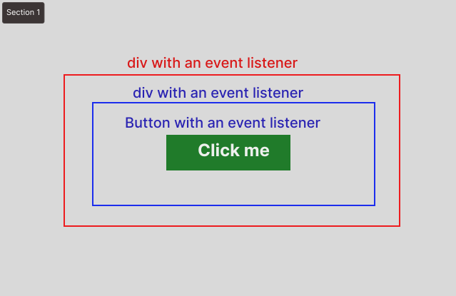
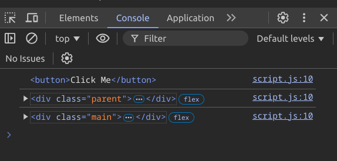
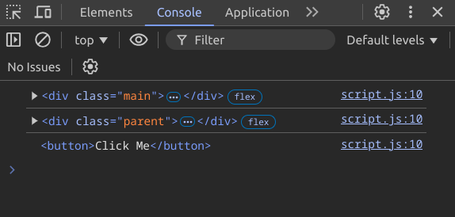

### ইভেন্ট ডেলিগেশন (event deligation) কি ?

ইভেন্ট ডেলিগেশন হলো একাধিক এলিমেন্টের জন্য একটাই ইভেন্ট লিসেনার রাখা এবং নতুন কোন এলিমেন্ট যুক্ত হলেও যেন লিসেনার কাজ করে ।

ইভেন্ট ডেলিগেশন হলো এমন একটা টেকনিক যা মূলত দুইটা জিনিসে ফোকাস করেঃ-

1. **একাধিক এলিমেন্টের জন্য একটাই ইভেন্ট লিসেনার থাকবে ।**

2. **যদি কখনো নতুন এলিমেন্ট যুক্ত হয় তাতেও যেন ইভেন্ট লিসেনার ঠিকঠাক ভাবে কাজ করে।**

ধরুন আমাদের একটি প্রোডাক্টের ডাটার লিস্ট আছে যা `API` থেকে আসতেছে। এবং আমরা চাই এই প্রতিটা ডাটার জন্য এমন একটা ফাংশনালিটি বানাতে যাতে প্রতিটা ডাটার নামে উপর ক্লিক করলেই সেই ডাটার নামের পিছনে একটা ব্যাকগ্রাউন্ড কালার যুক্ত হবে।

এখন বিষয়টি এমন ভাবে করতে পারি যে আমরা প্রতিটা আইটেমকে ধরে ধরে তাতে ইভেন্ট লিসেনার লাগিয়ে কাজ করতে পারি। এতে হয়তো একটা সমাধান হতে পারে, কিন্তু যেহেতু ডাটাগুলো `API` থেকে আসছে তাই আমরা জানিনা হয়তো ডাটার সংখ্যা চেঞ্জ হয়ে যেতে পারে,বা ডাটা বারতে পারে। তখন কি প্রতিটা বারতি ডাটার জন্য আমরা প্রতিবার ইভেন্ট লিসেনার এড করবো ? এটা কখনই সম্ভব না। তাছাড়া প্রতিটা এলিমেন্টের জন্য আলাদা আলাদা লিসেনার এড করতে গেলেও ব্যাপারটা `messy` হয়ে যাবে। তাহলে উপায় ? উপায় হলো **ইভেন্ট ডেলিগেশন টেকনিক**

চলুন জেনে নেই সেটা কিভাবে করেঃ

```jsx filename="index.html" showLineNumbers
<div class='list-of-item'>
    <ul id='list'>
        <li class='item'>Apple</li>
        <li class='item'>Orange</li>
        <li class='item'>Strawberry</li>
        <li class='item'>Banana</li>
    </ul>
</div>
```

উপরের এই লিস্ট অফ আইটেমগুলোতে আমরা ইভেন্ট ডেলিগেশন টেকনিক এপ্লাই করবো। এতে আমাদের **`item` গুলোর প্যারেন্ট এলিমেন্ট `ul` এ গিয়ে ইভেন্ট লিসেনার এড করা লাগবে। যাতে আমরা একটা লিসেনার দিয়েই সমস্ত `item`গুলোকে ধরতে পারি।**

```javascript filename="index.js" showLineNumbers
const list = document.getElimentById("list");
list.addEventListener("click", (e) => {
    e.target.style.backgroundColor = "yellow";
});
```

এখানে আমরা `item`গুলোর প্যারেন্ট এলিমেন্ট `ul`এ ইভেন্ট লিসেনার এড করেছি এবং প্রতিবার ক্লিক এ `e.target` করে যেটাতে ক্লিক করা হয়েছে সেটাতে ব্যাকগ্রাউন্ড কালার এড করেছি। এর মাধ্যমেই আমরা ইভেন্ট ডেলিগেশন করে ফেলেছি। মানে আমরা ইভেন্টটাকে প্যারেন্টের কাছে ডেলিগেট করেছি।

এখন কথা হলো যে, এতে তো `ul` এর এরিয়াতে ক্লিক পড়লে `ul` এও ব্যকগ্রাউণ্ড কালার চেঞ্জ হয়ে যাবে।

সেক্ষেত্রে আমাদের হেল্প করবে `html DOM` এর `element.matches()` মেথড।

`element.matches()`মেথড `string` হিসেবে একটা ভ্যালু নেয় এবং তা ম্যাচ করে দেখে যে এলিমেন্টের সাথে ম্যাচ করেছে কিনা, এবং `Boolean` ভ্যালু রিটার্ন করে।

তাহলে আমরা এভাবে করতে পারিঃ

```javascript filename="index.js" showLineNumbers
const list = document.getElimentById("list");
list.addEventListener("click", (e) => {
    if(e.target.matches("li"){
        e.target.style.backgroundColor = "yellow";
    }

});
```

এভাবে করলে দেখবেন যদি লিস্ট এ নতুন আইটেম যুক্তও হয় তবুও এই একটা লিসেনারই ঠিকঠাক ভাবে কাজ করবে।

এটাকেই মূলত **ইভেন্ট ডেলিগেশন** বলা হয়ে থাকে।

---

### ইভেন্ট প্রপাগেশন (event propagation) কি ?

প্রপাগেশন শব্দের বাংলা অর্থ হলো বিস্তার করা বা প্রসারণ করা বা চলাচল করা।

ইভেন্ট প্রপাগেশন হলো জাভাস্ক্রিপ্টের একটা টার্ম । মূলত ইভেন্ট প্রপাগেশন বলতে বুঝায়, যে যদি কোন নেস্টেড এলিমেন্ট থাকে এবং তার প্রতিটা এলিমেন্টেই একটা করে ইভেন্ড লিসেনার এড করা থাকে,তখন যদি একদম ভিতরের কোন এলিমেন্ট ইভেন্টটা ট্রিগার করা হয় তখন আসলে কি ঘটবে?

যেমনঃ



উপরের ছবিতে আমরা তিনটা নেস্টেড এলিমেন্ট দেখতে পাচ্ছি যার প্রতিটাতেই ইভেন্ট লিসেনার এড করা আছে। এবং লিসেনার গুলো এলিমেন্টগুলোতে ক্লিক করলে ট্রিগার হবে।

```jsx filename="index.html" showLineNumbers
<div class='main'>
    <div class='parent'>
        <button>Click Me</button>
    </div>
</div>
```

```jsx filename="index.js" showLineNumbers
const main = document.querySelector(".main");
const parent = main.querySelector(".parent");
const button = parent.querySelector("button");

main.addEventListener("click", listener);
parent.addEventListener("click", listener);
button.addEventListener("click", listener);

function listener() {
    console.log(e.target);
}
```

এখন যদি আমরা `button` এলিমেন্টে ক্লিক করবো তাহলে আমরা দেখতে পাবো প্রতিটা লিসেনার এ কল হয়ে গেছে এবং কনসল এ তিনটার আউটপুট এসেছে । এইযে একটা ব্যাপার যে ক্লিক করলাম একটাতে আর লিসেনার কল হয়ে গেল তিনটাই, এই ব্যাপারটাকেই বলা হয় `event Propagation`। মানে ইভেন্টগুলো বাকিদের মাঝেও ছড়িয়ে গেছে।

### ইভেন্ট বাবলিং (Bubbling) কি ?

```jsx filename="index.js" showLineNumbers
const main = document.querySelector(".main");
const parent = main.querySelector(".parent");
const button = parent.querySelector("button");

main.addEventListener("click", listener);
parent.addEventListener("click", listener);
button.addEventListener("click", listener);

function listener() {
    console.log(e.currentTarget);
}
```

আউটপুটঃ



উপরের কোডটার আউটপুট দেখলে আমরা বুঝতে পারবো যে প্রথমে `button` তারপর `parent` এবং সবশেষে `main` এলিমেন্টে ইভেন্ট লিসেনার ট্রিগার হয়েছে, তার মানে হলো প্রপাগেশন ভিতর থেকে শুরু হয়ে বাহিরের দিয়ে যায়। এটাই হলো প্রোপাগেশন এর ডিফল্ট বিহেবিয়ার। এই যে ভিতর থেকে শুরু হলে বাহিরের দিয়ে ছড়িয়ে যাওয়ার ব্যাপারটাকে অনেকটা বাবল এর মতো চিন্তা করা হয়, তাই একে বলা হয় **ইভেন্ট বাবলিং (event bubbling)**

### ইভেন্ট কেপচারিং বা ট্রিকলিং (capturing or trickling) কি ?

আমরা ইভেন্ট প্রপাগেশনের ডিফল্ট বিহেবিয়ার জানলাম যে প্রপাগেশন ভিতর থেকে শুরু হয়ে বাহিরের দিকে ছড়ায়, কিন্তু আমরা চাইলে এটাকে চেঞ্জ করতে পারি, আমরা চাইলে এটাকে পরিবর্তন করে বাহির থেকে শুরু করে ভিতর দিকে নিতে পারি।

তারজন্য আমাদের ইভেন্ট লিসেনার এর তৃতীয় প্যারামিটার এ `{capture:true}` করে দিতে হয়। ডিফল্টভাবে `{capture:false}` করা থাকে।

```jsx filename="index.js" showLineNumbers
const main = document.querySelector(".main");
const parent = main.querySelector(".parent");
const button = parent.querySelector("button");

main.addEventListener("click", listener, { capture: true });
parent.addEventListener("click", listener, { capture: true });
button.addEventListener("click", listener, { capture: true });

function listener() {
    console.log(e.currentTarget);
}
```

আউটপুটঃ



এইযে আমরা প্রপাগেশনকে `capture` করে এর ডিরেকশন চেঞ্জ করলাম এটাকে বলা হয় **ইভেন্ট কেপচারিং বা ট্রিকলিং (capturing or trickling)**।

### Propagation in React

রিয়াক্টে সকল ইভেন্ট ই প্রপাগেট হয়,শুধুমাত্র `onScroll` ইভেন্ট ছাড়া ।

### কিভাবে রিয়াক্টে প্রপাগেশন স্টপ করতে হয় ?

রিয়াক্টে প্রপাগেশন স্টপ করার জন্য `event handler` এর ভিতরে `e.stopPropagation()` মেথড কল করে দিতে হয় ।

```jsx filename="App.jsx" showLineNumbers
function Button({ onClick, children }) {
    return (
        <button
            onClick={(e) => {
                e.stopPropagation(); // এখানে প্রপাগেশন স্টপ করা হয়েছে
                onClick();
            }}>
            {children}
        </button>
    );
}

export default function Toolbar() {
    // এই কম্পোনেন্টে তিনটা এলিমেট আছে নেস্টেড ভাবে এবং প্রতিটা এলিমেন্টেই ইভেন্ট হ্যান্ডেলার এড করা আছে। তার মানে ডিফল্ট ভাবে এখানে প্রপাগেশন হবে ।
    return (
        <div
            className='Toolbar'
            onClick={() => {
                alert("You clicked on the toolbar!");
            }}>
            <Button onClick={() => alert("Playing!")}>Play Movie</Button>
            <Button onClick={() => alert("Uploading!")}>Upload Image</Button>
        </div>
    );
}
```

### Preventing the default behavior

আমরা যখন কোন ফর্ম এর সাবমিট বাটনে ক্লিক করি,তখন ফর্মের ডিফল্ট বিহেবিয়ার হলো ফর্মটা সাবমিট হউয়ার সাথে সাথে ব্রাউজারে পেজটাও রিলোড হয়।

আমরা যদি এই ডিফল্ট বিহেবিয়ার কে বন্ধ করতে চাই, তাহলে আমরা `e.preventDefault()` মেথড কল করে দিতে পারি।

```jsx filename="App.js" showLineNumbers
export default function Signup() {
    return (
        <form
            onSubmit={(e) => {
                e.preventDefault();
                alert("Submitting!");
            }}>
            <input />
            <button>Send</button>
        </form>
    );
}
```

