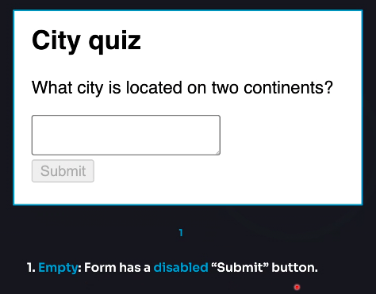
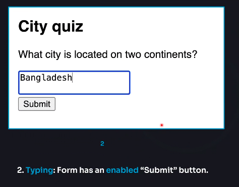
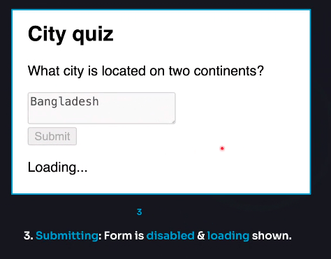
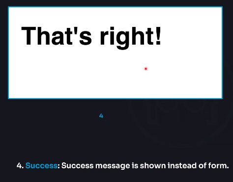
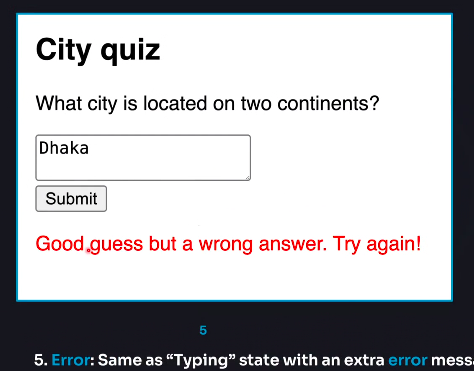
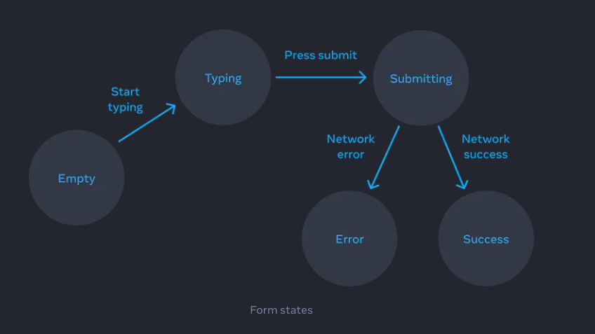

import { Steps } from "nextra/components";

### ইউ আই-কে ডিক্লারেটিভলি ভাবা (Thinking about UI declaratively)

আমরা যখনি রিয়াক্টের কোন UI কে পরিবর্তন বা ম্যানেজ করতে চাইবো তখন আমাদের স্টেট দিয়ে তা ম্যানেজ করা লাগবে । একটা কম্পোনেন্টে কি কি স্টেট থাকতে পারে বা কিভাবে খুব সুন্দর করে স্টেটগুলো ম্যনেজ করতে হবে তা খুব ভালোভাবে বুঝতে হলে আমাদের কয়েকটা স্টেপ অবশ্যই ফলো করতে হবে। নিচে এই স্টেপগুলো নিয়ে বিস্তারিত আলোচনা করবো। এই স্টেপগুলো খুব ভালোভাবে বুঝতে পারলে যেকোন কমপ্লেক্স UI এর স্টেট ম্যানেজমেন্ট খুব সহজেই করে ফেলা সম্ভব। চলুন স্টেপগুলো জানি,

1. **Identify Components differnet visual states**
2. **Determine What trigger those state changes**
3. **Represent the state in memory useing `useState`**
4. **Remove any not-essential state variables**
5. **Connent the event handlers to set the state**

<Steps>
### Identify Components differnet visual states (কম্পোনেন্টের কি কি পরিবর্তন বা অবস্থা হতে পারে,তা নির্ধারণ করা)

প্রথমেই আমাদের বুঝতে হবে যে আমাদের UI তে কি কি পরিবর্তন হতে পারে। মানে UI টা কি কি অবস্থায় স্ক্রিনে দেখা যাবে।

উদাহরণ হিসেবে, ধরুন আমারা একটা ফর্ম এর কথা ভাবি, ফরমটা একটা প্রশ্নের উত্তর নেয়, এবং উত্তর সঠিক হলে সাকসেস মেসেজ দেখায় আর ভুল হলে ইরর মেসেজ দেখায়। আর ফর্ম টায় কোন কিছু না লিখা হলে ফর্মটা ডিসেবল থাকে, আর কিছু লিখে ফর্মটা সাবমিট করা হলে একটা লোডীং দেখায়।

তাহলে চলুন একটু ভিজুয়ালাইজ করি আমাদের এর কম্পোনেন্টের কি কি ভিজুয়াল স্টেট হতে পারে:

১।  ২।  ৩। ৪।  ৫। 

তাহলে এখানে আমরা UI তে পাচটি স্টেট দেখতে পাচ্ছি,`empty`, `typing`, `submitting`, `success`, `error` এতে আমরা ক্লিয়ার ধারনা পাই যা আমাদের UI তে কি কি পরিবর্তন হবে আর কখন কোন স্টেট এ থাকবে। এই ভাবে একটা কম্পোনেন্টের প্রতিটা ভিজুয়াল চেঞ্জকে রিপ্রেজেন্ট করা কে **স্টোরিবুকস** বলা হয়

### Determine what triggers those state changes (কোন কোন কারনে স্টেট এর পরিবর্তনগুলো ট্রিগার হবে তা নির্ধারন করা)

UI তে যেই স্টেট এর পরিবর্তনগুলো হবে,সেগুলো কিভাবে ট্রিগার হবে তা নির্ধারন করতে হবে। স্টেট এর পরিবর্তনগুলো কি ইউজারেরে কোন ইন্টারেকশনের কারনে হবে নাকি কম্পিউটার অটোমেটিক করবে তা নির্ধারন করতে হবে।

এক্ষেত্রে যেমন ইউজার ইনপুট ফিল্ডে কিছু লিখলে স্টেট হবে টাইপিং,আর সাবমিট করলে হবে সাবমিটিং।

আর ইরর হবে নাকি সাকসেস হবে সেটা কম্পিউটার নিজে ডিসিশন নিবে।

অর্থাৎ দ্বিতীয় স্টেপে আমাদের বুঝতে হবে যে, কখন কিভাবে স্টেট চেঞ্জ গুলো ট্রিগার হবে।

এই স্টেট চেঞ্জের স্টেপগুলোকে আমরা একটা ডায়াগ্রামে রিপ্রেজেন্ট করতে পারলে পুরো স্টেট চেঞ্জের ফ্লো-টা বোঝা অনেক সহজ হয়ে যায়। যেমনঃ



### Represent the state in memory with `useState` (`useState`ব্যবহার করে স্টেটগুলো কে রিপ্রেজেন্ট করা)

এই স্টেপে আমাদের যেসব স্টেটগুলো প্রয়োজন হবে সেগুলো কে `useState` হুক দিয়ে ইনিশিয়ালিজ করতে হবে বা ডিফাইন করতে হবে। এই উদাহরণে স্বাভাবিকভাবে দেখলে আমাদের পাঁচটা স্টেট লাগবে,

```jsx
const [isEmpty, setIsEmpty] = useState(true);
const [isTyping, setIsTyping] = useState(false);
const [isSubmitting, setIsSubmitting] = useState(false);
const [isSuccess, setIsSuccess] = useState(false);
const [isError, setIsError] = useState(false);
```

এছাড়াও আমাদেরকে ফর্মের ইনপুট হ্যান্ডেল করা আর ইরর হয়েছে কিনা তা বুঝার জন্য আরও দুইটা স্টেট অবশ্যই নেয়া লাগতে পারে।

```jsx
const [answer, setAnswer] = useState("");
const [error, setError] = useState(null);
```

### Remove any non-essential state variables(অপ্রয়োজনীয় স্টেট ভ্যারিয়েবল রিমুভ করে দেয়া)

এই পর্যায়ে আমাদের বুঝতে হবে যে আমরা যেই `state` গুলো ডিফাইন করেছি তার **প্রত্যেকটাই কি আমাদের লাগবে কিনা**, **কোন একটা স্টেট ভ্যারিয়েবল দিয়ে অন্যটার কাজ হয়ে যাচ্ছে কিনা** বা **কোন স্টেট ডুপ্লিকেট হচ্ছে কিনা** এবং **একই সময়ে দুইটা স্টেট কখনো সত্যি অথবা মিথ্যা (Paradox) হতে পারেনা এমন ক্ষেত্রে একই স্টেট নেয়া**

অর্থাৎ এই পর্যায়ে আমাদের স্টেটকে ক্লিনাপ করা লাগবে, অপ্রয়োজনীয় স্টেট ভ্যরিয়েবলগুলোকে রিমুভ করে দিতে হবে।

এক্ষেত্রে যেমন আমরা `empty` আর `typing` দুইটা ইনফরমেশনএর স্টেট দুইটা বাদ দিয়ে শুধুমাত্র `answer` স্টেট থেকেই সবকিছু ম্যনেজ করতে পারি। যেমন `answer.length == 0` মানে হলো `empty` আর `0` না হলে `typing` তাহলে আমরা খুব সহজেই `empty` আর `typing` এই দুইটা স্টেট রিমুভ করে দিতে পারি।

আবার বাকি তিনটা অবস্থা `submitting` `success`অথবা `error` আমরা শুধু একটা স্টেট ভ্যারিয়েবল `status` নিয়েই আমরা মেনেজ করতে পারি।

```jsx
const [status, setStatus] = useState("typing"); // 'submitting', or 'success / error'
```

তাহলে এখানে আমাদের শুধু তিনটা স্টেট নিলেই সমস্ত কিছু পারফেক্টলি হয়ে যাচ্ছে,

```jsx
const [answer, setAnswer] = useState("");
const [error, setError] = useState(null);
const [status, setStatus] = useState("typing"); // 'submitting', or 'success / error'
```

### Connect the event handlers to set state(স্টেটগুলো চেঞ্জ করার জন্য ইভেন্ট হ্যন্ডেলারগুলো কানেক্ট করিয়ে দিতে হবে)

এই পর্যায়ে আমাদের শুধু স্টেট এর সেটার ফাংশনগুলোকে ইভেন্ট হ্যান্ডেলারের সাথে কানেক্ট করিয়ে দিতে হবে, যাতে ইভেন্ট ট্রিগার হলেই স্টেটগুলো আপডেট হতে থাকে।

</Steps>

