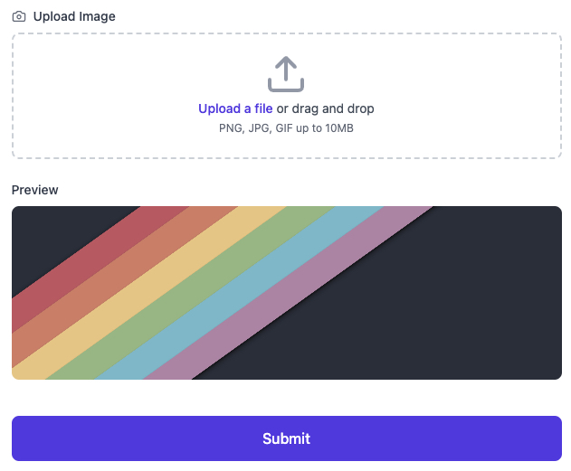

import { Callout, Steps } from "nextra/components";

##  Image Upload with Next.js with Drag and Drop and Image Preview

নেক্সট জে.এস এ কিভাবে ইমেজ আপলোড করতে হয় এবং কিভাবে ড্রাগ এন্ড ড্রপ ফিচার ইমপ্লিমেন্ট করে ইমেজ আপলোড এবং প্রিভিঊ দেখা যায় তা নিয়ে নিচে আলোচনা করা হলো।

এই জন্য আমারা নিচে একটা বেসিক ফর্ম এর কোড নিয়ে কাজ করবো।

```jsx filename="app.jsx"
import { Camera, Upload } from "lucide-react";
import { useRef, useState } from "react";

function App() {
    const [formData, setFormData] = useState({
        image: null,
    });
    const fileInputRef = useRef(null);
    const [imagePreview, setImagePreview] = useState(null);

    const handleSubmit = (e) => {
    // form submission logic will go here ....
    };

    const handleChange = (e) => {
        // input fileds change logic will go here ....
    };

    return (
        <div className='min-h-screen bg-gradient-to-br from-blue-50 to-indigo-50 py-12 px-4 sm:px-6 lg:px-8'>
            <div className='max-w-2xl mx-auto'>
                <div className='bg-white rounded-2xl shadow-xl p-8'>
                    <div className='flex items-center gap-3 mb-8'>
                        <Hotel className='h-8 w-8 text-indigo-600' />
                        <h1 className='text-3xl font-bold text-gray-900'>
                            Your Image Uploader
                        </h1>
                    </div>

                    <form onSubmit={handleSubmit} className='space-y-6'>

                        <div>
                            <label className='block text-sm font-medium text-gray-700 mb-2'>
                                <div className='flex items-center gap-2'>
                                    <Camera className='h-4 w-4 text-gray-500' />
                                        Upload Image
                                </div>
                            </label>
                            <div
                                onClick={() => fileInputRef.current?.click()}
                                className='mt-1 flex justify-center px-6 pt-5 pb-6 border-2 border-gray-300 border-dashed rounded-lg cursor-pointer hover:border-indigo-500 transition-colors duration-200'>
                                <div className='space-y-1 text-center'>
                                    <Upload className='mx-auto h-12 w-12 text-gray-400' />
                                    <div className='flex text-sm text-gray-600'>
                                        <label className='relative cursor-pointer rounded-md font-medium text-indigo-600 hover:text-indigo-500 focus-within:outline-none focus-within:ring-2 focus-within:ring-offset-2 focus-within:ring-indigo-500'>
                                            <span>Upload a file</span>
                                            <input
                                                ref={fileInputRef}
                                                type='file'
                                                className='sr-only'
                                                accept='image/*'
                                                required
                                            />
                                        </label>
                                        <p className='pl-1'>or drag and drop</p>
                                    </div>
                                    <p className='text-xs text-gray-500'>
                                        PNG, JPG, GIF up to 10MB
                                    </p>
                                </div>
                            </div>
                        </div>

                        {imagePreview && (
                            <div className='mt-4'>
                                <p className='text-sm font-medium text-gray-700 mb-2'>
                                    Preview
                                </p>
                                <div className='relative h-48 rounded-lg overflow-hidden'>
                                    
                                </div>
                            </div>
                        )}

                        <div className='pt-4'>
                            <button
                                type='submit'
                                className='w-full flex items-center justify-center px-8 py-3 border border-transparent text-base font-medium rounded-lg text-white bg-indigo-600 hover:bg-indigo-700 focus:outline-none focus:ring-2 focus:ring-offset-2 focus:ring-indigo-500 transition-colors duration-200'>
                                Submit
                            </button>
                        </div>
                    </form>
                </div>
            </div>
        </div>
    );
}

export default App;
```




আমাদের উপড়ের কোডে আমরা একটা বেসিক ফর্ম দেখতে পাচ্ছি,যেখানে একটা ইমেজ আপলোড করার ফিল্ড আছে,এবং এখানে যাতে ইমেজ ড্রাগ করে পেস্ট করা যায় তেমন করে ডিজাইন করা আছে। এবং তার নিচে প্রিভিও শো করার জন্য একটা প্রিভিউ সেকশন আছে।

তাহলে চলুন এবার আমরা স্টেপ বাই স্টেপ জেনে নেই আমরা কিভাবে ইমেজ আপলোড করবো এবং সেটার প্রিভিঊ দেখতে পাবো। সেই সাথে আমরা যেন ইমেজ ড্রাগ করে আপলোড করতে পারি সেটা দেখবো।

<Steps>
  ### Upload image by click 

    প্রথমে চলেন আমরা ক্লিক করে ইমেজ আপলোডের অপশন বানাই। এজন্য আমাদেরকে `<input type='file'>` এ একটা `onChange` ইভেন্ট হেন্ডেলার এড করা লাগবে যাতে আমারা ক্লিক করে ইমেজ আপলোড করলে সেই ইভেন্ট টাকে ধরে ইমেজ নিয়ে কাজ করতে পারি।

    ```jsx {2,9-16}
            <div
               onClick={() => fileInputRef.current?.click()}
               className='mt-1 flex justify-center px-6 pt-5 pb-6 border-2 border-gray-300 border-dashed rounded-lg cursor-pointer hover:border-indigo-500 transition-colors duration-200'>
               <div className='space-y-1 text-center'>
                   <Upload className='mx-auto h-12 w-12 text-gray-400' />
                   <div className='flex text-sm text-gray-600'>
                       <label className='relative cursor-pointer rounded-md font-medium text-indigo-600 hover:text-indigo-500 focus-within:outline-none focus-within:ring-2 focus-within:ring-offset-2 focus-within:ring-indigo-500'>
                           <span>Upload a file</span>
                           <input
                               onChange={handleImageChange}
                               ref={fileInputRef}
                               type='file'
                               className='sr-only'
                               accept='image/*'
                               required
                           />
                       </label>
                       <p className='pl-1'>or drag and drop</p>
                   </div>
                   <p className='text-xs text-gray-500'>
                       PNG, JPG, GIF up to 10MB
                   </p>
               </div>
            </div>
    
    ```

 এই কোডে আমরা ডিজাইনটা সুন্দর করার জন্য ডিফল্ট ফাইল ইনপুটটাকে হাইড করে একটা ডিভ এর সাথে `ref` ব্যবহার করে কানেক্ট করেছি এবং সেই ডিভ এ ক্লিক করলে যাতে `<input type='file'>`  ক্লিক হয় তার জন্য ডিভ এর `onClick` এ 
```jsx

  onClick={() => fileInputRef.current?.click()}

``` 
ব্যাবহার করেছি। এতে আমরা যখনি ডিভ এ ক্লিক করছি তখন আমাদের ফাইল আপলোডার টা ক্লিক হয়ে যাচ্ছে।

তারপর আমরা 
```jsx {2}
      <input
         onChange={handleImageChange}
         ref={fileInputRef}
         type='file'
         className='sr-only'
         accept='image/*'
         required
     />

```
 `<input type='file'>` এ একটা ইভেন্ট হেন্ডেলার `handleImageChange` এড করেছি যাতে আমরা ইভেন্টটাকে ধরতে পারি।

 তাহলে এবার এই ইভেন্ট হ্যান্ডেলার নিয়ে কাজ করা যাক।

 ```js
     const handleImageChange = (e) => {
        const file = e.target.files?.[0];

        if (file) {
            setFormData((prev) => ({ ...prev, image: file }));
        }
    };
 
 ```

এই হেন্ডেলার এ আমরা `e.target.files?.[0]` দিয়ে আমারা যেই ফাইলটাকে আপলোড করেছি সেটাকে ধরেছি এবং `setFormData((prev) => ({ ...prev, image: file }));` দিয়ে আমারা ফাইলটাকে স্টেট এ স্টোর করেছি যাতে আমরা এই ফাইলটাকে পরবর্তি সময়ে সার্ভারে পাঠাতে পারি।


### Show Preview of Uploaded Image

এই পর্যায়ে আমরা আমাদের আপলোড করা ইমেজের প্রিভিও শো করাবো। প্রিভিঊ শো করানোর জন্য আমরা নিচে একটা প্রিভিও সেকশন নিয়েছি এবং স্টেট এর মাধ্যমে সেখানে ইমেজ এর সোর্স সেট করছি।

```jsx
    const [imagePreview, setImagePreview] = useState(null);

    //componets code 
    {imagePreview && (
       <div className='mt-4'>
           <p className='text-sm font-medium text-gray-700 mb-2'>
               Preview
           </p>
           <div className='relative h-48 rounded-lg overflow-hidden'>
               
           </div>
       </div>
    )}

```

এবারে আমরা যেই ফাইলটাকে ধরেছিলাম ইভেন্ট হেন্ডেলারের মাধ্যমে সেই ইভেন্ট হেন্ডেলারে ফাইলটাকে আমারা জাভাস্ক্রিপ্ট এর নেটিভ `FileReader()`API দিয়ে একটা `bese64 encoaded image file` বানাবো এবং সেটা `imagePreview` স্টেট এ সেট করে দিবো।

 ```js {7-11}
     const handleImageChange = (e) => {
        const file = e.target.files?.[0];

        if (file) {
            setFormData((prev) => ({ ...prev, image: file }));

            const reader = new FileReader(); // FileReader() API instance create
            reader.readAsDataUrl(file) // read file as data URL
            reader.onLoadend = ()=>{ // reader callback
                setImagePreview(reader.result) // set data url in state
            }
        }
    };
 
 ```
তাহলেই স্টেট থেকে URL এর মাধ্যমে আমাদের প্রিভিঊ সেকশনের ইমেজের প্রিভিঊ দেখা যাবে।

### Upload image by Drag and Drop
 ড্রাগ এন্ড ড্রপ করে ইমেজ আপলোড কড়ার জন্য আমাদেরকে দুইটা ইভেন্ট হেণ্ডেলার নিয়ে কাজ করতে হবে `onDragOver`,`onDrop`
```jsx
 <div
    onDragOver={(e) => {
        e.preventDefault();
        e.stopPropagation();
    }}
    onDrop={handleImageDrop}
    onClick={() => fileInputRef.current?.click()}
    className='mt-1 flex justify-center px-6 pt-5 pb-6 border-2 border-gray-300 border-dashed rounded-lg cursor-pointer hover:border-indigo-500 transition-colors duration-200'>
   /*  rest of the code goes here */
</div>
                
```
আমরা যেই ডিভ এ ইমেজ কে ড্রাগ করে ড্রপ করতে চাই সেই ডিভ এ
 `onDragOver={(e) => {
        e.preventDefault();
        e.stopPropagation();
    }}
onDrop={handleImageDrop}`
 এই দুইটা ইভেন্ট এবং হেন্ডেলার এড করবো। মনে রাখতে হবে আমারা `onDragOver` হেন্ডেলার কে ` e.preventDefault();
        e.stopPropagation();` করে নিবো। নাহলে আমরা যখন ইমেজ কে ওই ডিভ এর উপর দিয়ে ড্রাগ করে নিয়ে যাবো, তখনি ব্রাঊজার ইমেজটাকে ওপেন করে ফেলবে। আর `onDrop` ইভেন্ট হেন্ডেলার `handleImageDrop` দিয়ে আমরা ফাইলটাকে ধরে ম্যনেজ করাবো।

```jsx
function handleImageDrop(e){

    const file = e.dataTransfer.files?.[0]
    if(file && file.type.startsWith("image/")){
    setFormData((prev) => ({ ...prev, image: file }));

}

```
তাহলেই আমাদের ইমেজ আপলোড হয়ে যাবে এবং আমরা সেটা স্টেট এ রেখে দিয়েছি।


### Show Image Preview by Drag and Drop

এখানেও আমাদের আগের প্রসেসেই কাজ করতে হবে,যেমনটা নিয়ে দেয়া আছে।
```jsx
function handleImageDrop(e){

    const file = e.dataTransfer.files?.[0]
    if(file && file.type.startsWith("image/")){
    setFormData((prev) => ({ ...prev, image: file }));

    const reader = new FileReader();
    reader.readAsDataUrl(file);
    reader.onLoadend = ()=>{
        setImagePreview(reader.result)
        }
    }
}

```

</Steps>